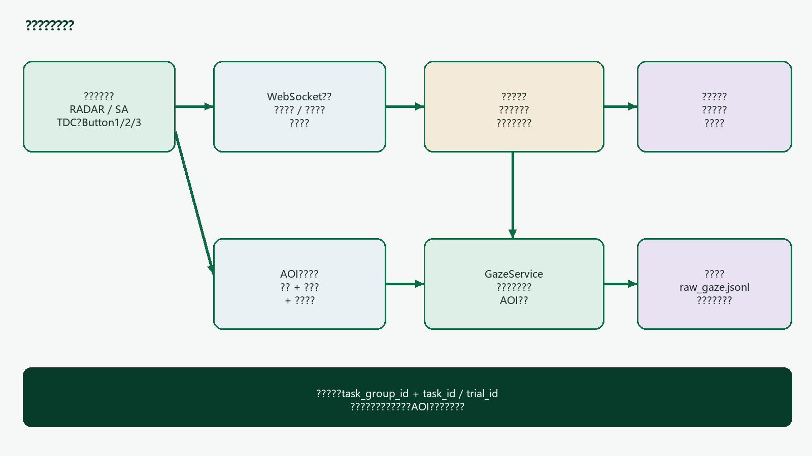
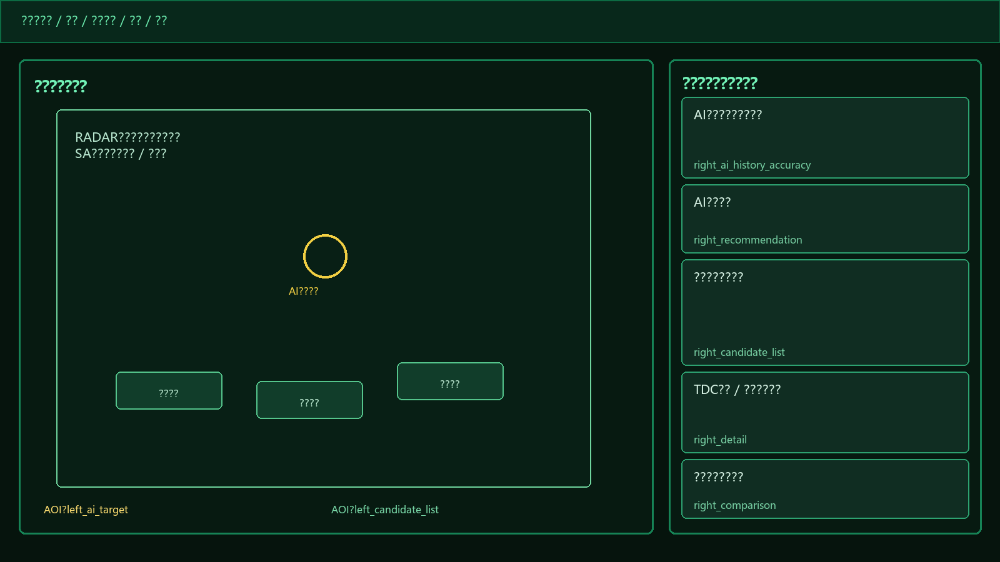

# ????

| ?? | ?? | ???? | ?? |
|---|---|---|---|
| V1.0 | 2026?7?21? | ?????????????????????UI???????AOI??????? | ??? |

# ??

1. ???????????
2. ?????????
3. ?????????
4. UI???????
5. ???TDC???????
6. ??????
7. ???????
8. ??AOI?????
9. ??????
10. RADAR?SA?????
11. ??????????
12. ???????????
13. ??A????
14. ??B??????
15. ??C???????

---PAGE---

# 1 ???????????

????????????????????????????????????????????????????????????????????????????????????????????????????????????????????

## 1.1 ???????????

| ????? | ?????? | ?? |
|---|---|---|
| 2.1??????? | RADAR_TARGETING??????????AI?????TDC???IFF?????? | ??? |
| 2.2?????? | SA_THREAT_ASSESSMENT??????????AI?????TDC??????????? | ??? |
| ?4??7?????1 | AI????????????????????????????????? | ???? |
| ?5??8?????2 | ???????AI???????????????????? | ???? |
| ???????????? | ????????AI????????????????????????AI?????? | ?? |
| ????????? | ?????3????????????????????AI????? | ??? |
| ??????? | ??????AOI????????aoi_hits???I-VT??? | ??? |
| ????????? | ??questionnaire_responses???????????????????????trial_id????? | ?? |

::: info | ?????? | ????????????trust_support????????????????????????????????????????????????

## 1.2 ????

- ?????????????WebSocket????Tobii????????
- ?1??????????2????????IFF????????????3??????????7??????????
- ???timeout???????????????????????????????
- ?????enemy?friend ID??????????????????AI???
- ????????????????????????
- ?????????????????????????????????

# 2 ?????????



## 2.1 ???????

| ?? | ?? | ???? |
|---|---|---|
| task_group_id | ??????? | ?????????????????????????????? |
| task_id | ???????? | ?????????RADAR?SA?????ID??????????????? |
| trial_id | ?????? | ???????task_id????????????????AOI???? |
| trial_sequence | ?????? | ???????????????? |
| gaze_session_id | ?????? | ????????????????????????????task_id? |
| event_id | ???????? | ???????????????? |

::: warn | ???? | task_id??????????????????????????????task_id?gaze_session_id???????????????????????

## 2.2 ??????

condition_key?task_group_id?task_type?difficulty?ai_level?????

user_id?????????????task_group_id?????????????????????????????????????????????AI???????????

## 2.3 ?????????

| ?? | ???? | ??????? |
|---|---|---|
| ????? | ?????????TDC???????????????????? | ???????????????? |
| ??????? | ??????????????????????????????? | ???????????????? |
| ????? | ?????????????????? | ?????????? |
| GazeService | ??AOI?????????? | ???????????????? |
| ???? | ???????????????????? | ?????????? |

---PAGE---

# 3 ?????????

## 3.1 ??????

accepted_ai??human_final_selection?ai_recommendation?????

| AI?????? | ??????AI | ???? | ?? |
|---|---|---|---|
| ?? | ? | appropriate | ???? |
| ?? | ? | under_trust | ?????? |
| ?? | ? | appropriate | ???? |
| ?? | ? | over_trust | ?????? |

??????????????????????????AI??????????????????????trust_outcome?

::: info | ???????? | TDC??????????????????????????????????????????????????????????????

## 3.2 ?????????

appropriate_rate??Nappropriate??Nvalid_trials?under_trust_rate?over_trust_rate???????direction_index??Nunder_trust?Nover_trust????Nvalid_trials?AI?????????????????AI????????????????

- Nvalid_trials???????AI?????????????????????
- ??????????????????????????????????
- ????history_count??0?ui_mode??standard????????????0????
- ????????????????????????appropriate?
- AI???????????????????????trust_outcome?ui_mode?
- ????????12????????????????????????75%?3/4??

## 3.3 ????

| ???? | ui_mode | ?????? |
|---|---|---|
| ?????? | standard | ?????history_count??0? |
| ????appropriate | standard | ????? |
| ????under_trust?over_trust | trust_support | ????????? |

?????trust_support?????????????????????????????????UI???????????????????????????

## 3.4 ????????

| ??? | ??????? | ??????? |
|---|---|---|
| ???? | ?????????????????? | ??????????????????? |
| AI???? | AI???????????????????? | ??????? |
| ??????? | TDC?????????????? | ??????? |
| ???? | AI??????????????? | ????????????? |
| ???? | ??outcome??????????? | ???????????history_before? |

# 4 UI???????



## 4.1 ????

????????????????????????????????RADAR?SA???????????????????ui_mode???????????AOI???????

| ?? | ?? | ???? | ?????? |
|---|---|---|---|
| ???? | AI??????? | ????12?????????????????????????????? | trust_control.ai_history?? |
| ???? | AI???? | ??????????????AI???????? | ????AI?????????? |
| ???? | ???????? | ????????????????AI???? | ???????? |
| ???? | TDC????????? | ?????TDC????????????AI????? | TDC??????? |
| ???? | ???????? | ??????????AI????????????? | AI??????? |
| ???? | AI???? | ?????????????????????????? | ?????????? |
| ???? | ???????? | RADAR??????SA??????? | ??DOM???? |

## 4.2 standard?trust_support???

| ?? | standard | trust_support |
|---|---|---|
| ?????????AOI | ??? | ?standard????? |
| AI?????? | ?????? | ?????????????????TDC????????????? |
| ????? | ??????? | ???????????????????????????? |
| ?????? | ???3???????? | ?????????????????????????? |
| ???????? | ???? | ?????????????????????? |

## 4.3 ??4??5??7??8????????

| ?? | ?? | ??????? | ???? |
|---|---|---|---|
| ?4 | ????? | AI????? | ????????????????TDC???????? |
| ?5 | ????? | ?????AI?????? | ??????????????????? |
| ?7 | ???? | sa_task_updated???????AI????? | ?RADAR?????????????SA??????? |
| ?8 | ???? | ?????AI?????? | ??????????????????????? |

::: info | ???? | ??????????????????????????????????????TDC???????????????3???????????????????????????????

## 4.4 ???????????

| ?? | ??????? | ????????? |
|---|---|---|
| RADAR | ??????????????????????????????????????????? | ????ID?????????????????????? |
| SA | ?????????????????????????????????????????? | ????ID??????????????????????????? |

?????????????????????????????????????????AI???TDC???????????????????????

## 4.5 ?????????

| ?? | ??? | ?????? | TDC?? | ???? | ????? |
|---|---|---|---|---|---|
| ????? | ?????????? | ??? | ??? | ??? | ??? |
| ???? | ???? | ??AI??? | ??AI??? | ??AI??? | ??AI??? |
| ???? | ????????? | ?????AI?? | ??? | ??? | ??? |
| ?? | empty? | empty? | tdc_detail? | manual_review???AI??? | ?TDC???????? |
| ?? | ??? | ??? | ????????? | ????????? | comparison???? |

---PAGE---
# 5 ???TDC???????

## 5.1 ????

| ???? | ?????? | ???? | ?? |
|---|---|---|---|
| ?1? | buttons.button0 | button1 | SA?????RADAR?????????????? |
| ?2? | buttons.button1 | button2 | SA???????????RADAR??IFF?????? |
| ?3? | buttons.button2 | button3 | ?????????AI?????????? |
| ?7? | ???? | button7 | ????????????????? |
| ?? | ??? | subY? | ????????? |

::: warn | ???? | ???????????????3??????buttons.button2????????????button3????????????????????????????????????

## 5.2 TDC????

TDC???????????????focus_dwell_ms???detail_shown?TDC?????detail_hidden???duration_ms?

- RADAR??????30???SA??40???????150???
- TDC??????????????????1???human_selection_changed?
- ????????????right_detail?target_id????????
- ???????detail_shown?detail_hidden?????????????????????
- ????????????????????????

## 5.3 ???????

| ????? | ???? | ????? |
|---|---|---|
| Button3??????AI?? | ??????????AI???????????????????????????? | manual_review_started??????1???review_session_id? |
| Button3???? | ????????TDC??????????? | ??????????????? |
| Button3??? | ?????????????TDC??? | manual_review_ended?duration??????????????? |
| ?AI????? | ???????????? | manual_review_ignored???no_ai_recommendation??????1? |
| ????????????????????? | ????????? | ?????????ended?end_reason? |

??????????3???????????????????????????????????trial_id?????????????????AOI??

????????????????AI??????????????????????????????????TDC????????????????????

## 5.4 ????

comparison_visible??????human_selection??????human_selection?ai_recommendation???

- ????????right_comparison????comparison_shown?
- ???????AI?????????comparison_hidden??????
- ????????????????????
- ?????????????????????????????
- ????????????

---PAGE---

# 6 ??????

## 6.1 ????

| ?? | ???? | ???? |
|---|---|---|
| server/data/radar_operations.db | ????????????????????????? | ????????? |
| GazeService?gaze_records.db | AOI??????????????????????? | AOI???? |
| ???raw_gaze.jsonl | ?????gaze??????hit?hits???aoi_revision?aoi_hits? | ???????? |
| ????JSON?CSV | ?????????????????????????? | ??????? |

## 6.2 ??????

| ? | ????? | ?? |
|---|---|---|
| task_groups | id?user_id?task_type?started_at?completed_at?status | ????????????????? |
| task_runs | task_id?task_group_id?task_seq?status?started_at?completed_at?raw_config?raw_message | ???????????????task_id? |
| task_events | event_id?task_id?trial_id?task_group_id?task_type?ui_mode?event_type?target_id?timestamp?extra | TDC?????????????????? |
| trust_trial_outcomes | ????AI??????????????????????????????? | ??????trial_id????????? |
| questionnaire_responses | user_id?task_id?task_group_id?task_type?difficulty?autonomy_level?responses | ????????????????????12?? |

## 6.3 trust_trial_outcomes????

| ??? | ?? | ?????? |
|---|---|---|
| ????? | trial_id?task_id?task_group_id?user_id?trial_sequence?task_type?difficulty?ai_level | ???????????? |
| ?????? | ai_recommendation_json?human_final_selection_json?ground_truth_json | ???????????? |
| ???? | ai_correct?human_correct?accepted_ai?trust_outcome | ???trust_control? |
| ????? | ui_mode?history_count???????direction_index?AI???????? | ???????? |
| ?? | task_started_at_ms?ai_recommendation_shown_at_ms?final_selection_confirmed_at_ms?trial_completed_at_ms | ??????????? |
| ???? | manual_review_used?manual_review_count?manual_review_duration_ms?invalid_review_count | task_events?????? |

::: info | ?? | trust_trial_outcomes?trial_id?????????INSERT OR IGNORE?????????????????task_events??event_id???????????

## 6.4 gaze_aoi_snapshots??

| ?? | ?? |
|---|---|
| snapshot_id | ???????ID? |
| task_id?trial_id?task_group_id?task_type | ????????? |
| revision | ??????????task_id?revision????? |
| valid_from_us?valid_to_us | ????????????????????????? |
| layout_signature | ???????????????????????????? |
| display_json?coordinate_space | ?????????DPR????????? |
| regions_json | ??AOI??????visible?binding? |
| alignment_valid | ????????aoi_hits? |
| client_snapshot_id?client_captured_at_ms?created_at | ??????????????????? |

## 6.5 ??????

1. task_groups?????????started_at?
2. task_runs???????????task_id?
3. ???????????????outcomes?
4. ????????trust_trial_event??task_events?
5. ???????????????????trust_trial_outcome???task_run?
6. ??????????????task_groups.completed_at?
7. AOI??????????GazeService?????????????????
8. ???????????raw_gaze.jsonl?????????

---PAGE---

# 7 ???????

?????????REST?????????WebSocket????????????AOI???WebSocket???HTTP??????????????

## 7.1 ????

| ?? | ????? | ?? | ????? |
|---|---|---|---|
| ?????? | init_settings.trust_control | RADAR?????????????ui_mode? | ????????? |
| ?????? | sa_task_updated.trust_control | SA???????????????ui_mode? | ????????? |
| ?????? | joystick_data.data.buttons | ?????????buttons.button2?????3?? | ?????? |
| ?????? | trust_trial_event | ????????TDC?????????????????? | task_events |
| ?????? | task_result_confirmed.extra.trust_trial | ???2??????????????????? | task_runs?trust_trial_outcomes |
| ???GazeService | tobii_aoi_snapshot | ??????AOI??? | gaze_aoi_snapshots |
| GazeService??? | tobii_aoi_snapshot_result | ??revision?changed????snapshot_id? | ????????? |
| ???GazeService | tobii_hand | ????????? | ???attention_regions?hit?hits |

## 7.2 ????trust_control

```json
{
  "trust_control": {
    "condition_key": {
      "task_group_id": 8,
      "task_type": "RADAR_TARGETING",
      "difficulty": "low",
      "ai_level": "L2"
    },
    "history_count": 4,
    "ui_mode": "trust_support",
    "appropriate_rate": 0.50,
    "under_trust_rate": 0.25,
    "over_trust_rate": 0.25,
    "direction_index": 0.0,
    "ai_history_accuracy": 0.75,
    "ai_history_correct_count": 3,
    "ai_history_valid_count": 4,
    "disclose_ai_reliability": false
  }
}
```

SA???sa_task_updated?????????AI???????????????????????????????????sa_task_updated??????

## 7.3 ????trust_trial_event

```json
{
  "type": "trust_trial_event",
  "event_type": "manual_review_started",
  "event_id": "uuid",
  "trial_id": "42",
  "task_id": "42",
  "task_group_id": "8",
  "trial_sequence": 2,
  "task_type": "RADAR_TARGETING",
  "user_id": "P001",
  "ui_mode": "trust_support",
  "target_id": "enemy-3",
  "timestamp": 1779250000123,
  "extra": {
    "review_session_id": "uuid",
    "joystick_button": 3,
    "display_target_number": 3,
    "observation_snapshot": {
      "azimuth_deg": 9.0,
      "distance_nm": 61.3,
      "speed_raw": 3.5,
      "heading_deg": 75.1,
      "relative_heading_deg": 157.1,
      "data_time": "20:43:38.954"
    }
  }
}
```

target_id????????????????????????????observation_snapshot????AI???????????????

## 7.4 ????task_result_confirmed

```json
{
  "type": "task_result_confirmed",
  "task_id": "42",
  "extra": {
    "trust_trial": {
      "trial_id": "42",
      "trial_sequence": 2,
      "ai_recommendation": {"id": "enemy-3"},
      "human_final_selection": {"id": "enemy-2"},
      "ground_truth": {"id": "enemy-2"},
      "ai_recommendation_shown_at_ms": 1779250000000,
      "final_selection_confirmed_at_ms": 1779250008120,
      "manual_review_used": true,
      "manual_review_count": 1,
      "manual_review_duration_ms": 1260,
      "invalid_review_count": 0
    }
  }
}
```

???????????ground_truth?AI???????????task_id????????????????ai_correct?human_correct?accepted_ai?trust_outcome?

## 7.5 AOI????

```json
{
  "type": "tobii_aoi_snapshot",
  "task_id": "42",
  "trial_id": "42",
  "task_group_id": "8",
  "task_type": "RADAR_TARGETING",
  "client_snapshot_id": "uuid",
  "captured_at_ms": 1779250000000,
  "change_reasons": ["geometry_changed"],
  "layout_signature": "sha256...",
  "coordinate_space": "display_area_normalized",
  "display": {
    "fullscreen": true,
    "alignment_valid": true,
    "viewport_width_css_px": 1920,
    "viewport_height_css_px": 1080,
    "screen_width_css_px": 1920,
    "screen_height_css_px": 1080,
    "device_pixel_ratio": 1,
    "visual_viewport_scale": 1
  },
  "regions": [
    {
      "id": "right_detail",
      "shape": "rect",
      "visible": true,
      "left": 0.68,
      "top": 0.64,
      "right": 1.0,
      "bottom": 0.77,
      "binding": {
        "mode": "manual_review",
        "target_id": "enemy-3"
      }
    }
  ]
}
```

```json
{
  "type": "tobii_aoi_snapshot_result",
  "ok": true,
  "task_id": "42",
  "snapshot_id": "server-uuid",
  "revision": 7,
  "changed": true,
  "layout_signature": "sha256...",
  "client_snapshot_id": "uuid"
}
```

???????????valid_from_us??????captured_at_ms???????????????????changed?false??????????

---PAGE---

# 8 ??AOI?????

## 8.1 ????AOI

| AOI ID | ???? | binding?? | ??? |
|---|---|---|---|
| left_ai_target | ??AI??????DOM??????? | target_id??????null | ????????false |
| left_candidate_list | RADAR??????SA???????? | candidate_ids | ????????true |
| right_ai_history_accuracy | ??????????? | metric??ai_history_accuracy | ?????true |
| right_recommendation | AI?????? | target_id | ?????????target_id?null |
| right_candidate_list | ???????? | candidate_ids | ?????true |
| right_detail | TDC????????? | mode?target_id | ?????true |
| right_comparison | ?????? | mode?ai?human??ID | ????????true |

::: info | ????? | ?????AI??????????????????UI???????????????????right_ai_history_accuracy???????????

binding??????????????????????????????right_detail?target_id?null?mode?empty??????????????????????null????????

## 8.2 ???????

| ???? | ????????? |
|---|---|
| ???????????????????TDC????????????????????????? | ??????1???????visible????binding????? |
| ResizeObserver?MutationObserver?scroll?resize?fullscreen?DPR?visualViewport?? | ?????alignment_valid??? |
| WebSocket?? | ?????????????????changed?false??????? |
| ???????????????????????? | ?????????????????? |

????????????????????????????100????????????????10???????ID???????????????layout_signature????????????

## 8.3 ????????

??????innerWidth??screen.width?innerHeight??screen.height?screenX?screenY??0?visualViewport.scale??1????????2??????

????????alignment_valid?false??????gaze????????aoi_hits??????????????????????AOI?Tobii????????????

## 8.4 ????

```json
{
  "ts_us": 1779250000000000,
  "gaze": [0.421, 0.913],
  "hit": true,
  "hits": ["antenna_prompt"],
  "aoi_revision": 7,
  "aoi_hits": ["left_ai_target", "left_candidate_list"]
}
```

| ?? | ?? |
|---|---|
| hit?hits | ?????????????attention_regions?tobii_hand??? |
| aoi_revision | ?????????AOI??? |
| aoi_hits | ?????????AOI???????????????? |
| ?aoi_hits?? | ????AOI???alignment?????????????? |

::: warn | ???? | ??AOI??????????tobii_hand?????AOI????????hit??aoi_hits???????????gaze_targets?

## 8.5 ????

??raw_gaze.jsonl?gaze_aoi_snapshots????????????ai_recommendation_shown?final_selection_confirmed????????server/statistics/aoi_gaze_statistics.py?????

| ?? | ???? |
|---|---|
| ???? | I-VT?????30????????100??? |
| ???? | ??????????????100?????100????????????? |
| ?AOI?? | ????aoi_hits??????????????????????????? |
| ???AOI | ??????????AOI?????????????? |
| ?? | ?AOI??????????????????????????????????????????????? |
| ??? | ???????????????????????????JSON?CSV? |

---PAGE---
# 9 ??????

| ????? | ???? | ??? |
|---|---|---|
| ????? | Nappropriate??Nvalid_trials??100%? | trust_trial_outcomes |
| ???? | Nunder_trust??Nvalid_trials??100%? | trust_trial_outcomes |
| ????? | Nover_trust??Nvalid_trials??100%? | trust_trial_outcomes |
| AI??????? | ????????Nai_correct??Nvalid_trials??100%? | trust_trial_outcomes |
| ????AI???? | ???????????AI?????????????? | outcomes?task_events |
| ?????? | human_selection_changed?????????? | task_events |
| ?????? | ??????manual_review_started? | task_events?outcome?? |
| ???????? | manual_review_started?????????? | task_events |
| ???????? | ?manual_review_ended?duration_ms??? | task_events?outcome?? |
| AI??????????? | final_selection_confirmed_at_ms?ai_recommendation_shown_at_ms? | trust_trial_outcomes |
| ????? | ????????????????? | trust_trial_outcomes |
| ????????? | task_group.completed_at?task_group.started_at? | task_groups |
| ??????? | ??????????????? | trust_trial_outcomes |
| AOI????? | ??8.5?????? | raw_gaze?snapshots |
| ?????? | ???????????trial_id? | ??????????? |

::: info | ???? | ??????????????????????????????????????????????????????????????????

## 9.1 ?????????

- ??????????????????????
- ??AI????????????????????????????????
- ????????????????????????????????????????
- ?????????????????????????????????????
- ???????null??????0%???????????0????????????????

## 9.2 ????????????

?????????????????????????????????????????????????????????AI??????????????????????????????????????????????

???????????????????????????????????TDC????????????????????????????????????????

# 10 RADAR?SA?????

## 10.1 ?????

1. ???????task_id???????????????trust_control?
2. RADAR??init_settings?SA????sa_task_updated?????trust_control?
3. ???????????????AI??????????ai_recommendation_shown?
4. ?ui_mode?trust_support???AI?????????????
5. ????TDC??????????????right_detail????????
6. ????????3???AI????????????????????
7. ??????1?????????human_selection_changed?
8. ??????AI??????????right_comparison????????
9. ???????2?????????IFF??????
10. ????task_result_confirmed.extra.trust_trial????????????????task_run?
11. ?????????????????????????????

## 10.2 RADAR????

- AI??????????????????????????????
- ???1?????TDC????????2???IFF??????
- IFF??????????????????
- ?????????????????
- ???????????????task_id???????
- ???????????????left_ai_target??????AOI???

## 10.3 SA????

- sa_task_updated???????????????????????????????????
- sa_task_updated???????????????AI????????????????????
- ???1???????????2??????????????
- SA?????RADAR?????AI????????????????????????
- ??left_candidate_list?????????????????????
- AI?????????????????????????????

---PAGE---

# 11 ??????????

| ?? | ???? | ??? |
|---|---|---|
| ?????? | ????????????????????task_id? | task_runs???????????????ID? |
| ?????? | trial_id???????????????? | trust_trial_outcomes????? |
| ???? | task_result_confirmed????????task_id???????? | ??????? |
| ?AI???Button3 | ??manual_review_ignored???????????? | invalid_review_count??? |
| Button3?????? | ???manual_review_ended???duration? | ???????? |
| AOI???? | ?????changed?false????revision? | ???task_id?revision??????? |
| AOI??? | ????????revision????valid_to_us? | ??????????? |
| ???????? | ???????????gaze???aoi_hits? | alignment_valid?false? |
| WebSocket?? | ????AOI??????????????? | ???????????? |
| ??????? | ????????task_id?event_id??????? | ??????????? |

## 11.1 ????

????????????????AOI?????????AOI??????????valid_from_us??????captured_at_ms?????????????????????????task_id?trial_id?????

## 11.2 ????????

- ?????????task_run?????trust_trial_outcome?
- ??manual_review_started???review_session_id?ended??????????
- ??raw gaze??aoi_revision?????task_id???????????????
- ???????????1?????????????????
- ????????????????????????????????
- ???????????AOI????????????????valid_to_us?
- ?????????????????????????outcome????

## 11.3 AOI?????????

gaze_aoi_snapshots?task_id?revision????????????????????????????revision?????revision????????????????????layout_signature???gaze_session_id??????task_id???????????????????task_id?

---PAGE---

# 12 ???????????

## 12.1 ?????????????

| ?? | ??? | ???? | ?? |
|---|---|---|---|
| ???? | ??AI????????????? | ????????????????? | ??? |
| ???? | ???????????? | Button3?????????????? | ??? |
| ???? | AI??????????? | ?????????? | ??? |
| ???? | ?????????? | outcomes??????task_groups????? | ??? |
| ???? | ????????????????? | ?AOI???raw gaze?????? | ??? |
| ???? | ????????? | ???????????????trial_id???????? | ??? |

## 12.2 ?????

| ??? | ? | ????? |
|---|---|---|
| P0 | ??????????? | ?????????????UI???????questionnaire_responses???trial_id?task_id???????????? |
| P1 | ?????? | ?trust_control?trust_trial_event?tobii_aoi_snapshot??protocol_version?????????? |
| P1 | ???????? | ??task_type?ui_mode?trust_outcome?event_type?end_reason?????????????? |
| P1 | ????????? | ?display_target_number???target_id?????????????????????? |
| P2 | ???????? | ???????????????1/1?100%??????????????????? |
| P2 | ?????? | ??raw gaze?????????????????????????? |

::: warn | ???? | ????????????????????????????????????????????????????????????????????????????

## 12.3 ?????????????

| ?? | ??????? | ?????? |
|---|---|---|
| ????????UI | ??????? | ?????trust_support??????????? |
| ????? | ??????? | UI??standard?????????? |
| ???? | ?????????? | TDC??????????? |
| ???? | ??????? | ???3???????AI????? |
| ???? | ????? | ??????????? |
| ???? | ?????????? | ??????????? |
| AI??? | ??AI?????? | ??????????????????? |
| ???? | ???????hit? | ????AOI??????????? |
| ?? | ???? | ???timeout?????? |

---PAGE---

# ??A ????

| event_type | ?? | ??extra |
|---|---|---|
| ai_recommendation_shown | AI?????? | ?????????observation_snapshot |
| glow_started?glow_ended | trust_support????????? | reason |
| tdc_focus_enter?leave | TDC????????? | focused target?duration_ms |
| detail_shown?hidden | ??????? | mode?target?duration_ms |
| manual_review_started | ???3?????? | review_session_id?joystick_button?3?snapshot |
| manual_review_ended | ??????? | started?ended?duration?end_reason |
| manual_review_ignored | ?AI????? | reason?no_ai_recommendation |
| human_selection_changed | ???1???????? | previous?current target |
| comparison_shown?hidden | ??????????????? | AI????????duration_ms |
| final_selection_confirmed | ?????? | final target?timing |
| trial_completed | ???? | result summary |

?????????end_reason??button_released?trial_completed?task_changed?user_changed?recommendation_invalidated?joystick_disconnected?page_unloaded?

# ??B ??????

| ?? | ???? | ?? |
|---|---|---|
| ????UI | src/components/TrustControlPanel.tsx | ???????????????????AOI??? |
| ?????? | src/hooks/useTrustTrial.ts | ??????TDC?Button3??????????? |
| AOI??? | src/hooks/useTrustAoiSnapshot.ts | DOM?????????????????? |
| ????????? | src/hooks/useRadarData.ts | ??button0?button1?button2???button1?button2?button3??????AOI??? |
| RADAR?? | src/components/Radar.tsx?RadarDisplay.tsx | ?????????IFF???? |
| SA?? | src/components/SAPage.tsx | ???????????????? |
| ??????? | server/core/message_handler.py | ????????????????????? |
| ???? | server/services/trust_control.py | ???????????????????? |
| ????? | server/managers/database_manager.py | ??????outcome?????????? |
| AOI?? | server/tobii/gaze_service.py | ????????????????? |
| AOI???? | server/network/websocket_server.py?http_server.py | tobii_aoi_snapshot?????? |
| ???? | server/statistics/aoi_gaze_statistics.py | I-VT?AOI????????????? |
| ??AOI?? | server/docs/dynamic_aoi_analysis.md | ??AOI???????? |

# ??C ???????

- ?????????standard?history_count?0???????????
- ?????????standard?????????????????trust_support?
- Button3???buttons.button2???????????????
- ???????AI????????????????????
- TDC?????????????????1?????????
- ??????????????????????????
- task_result_confirmed??????????outcome?
- ??AOI????visible?binding????????revision???
- ????????????AOI???????????????
- ???????????aoi_hits??????gaze?
- ??????????????????AI????????????????
- RADAR?SA??????ID???????????
- ???????????????trial_id?????
- ????????????????ui_mode?
- ??public?dist?????????????????init_config???

?????
