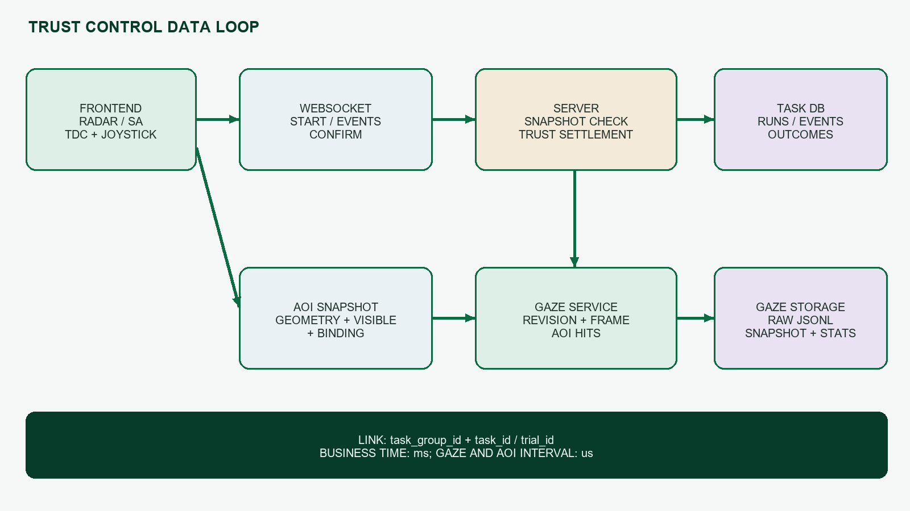
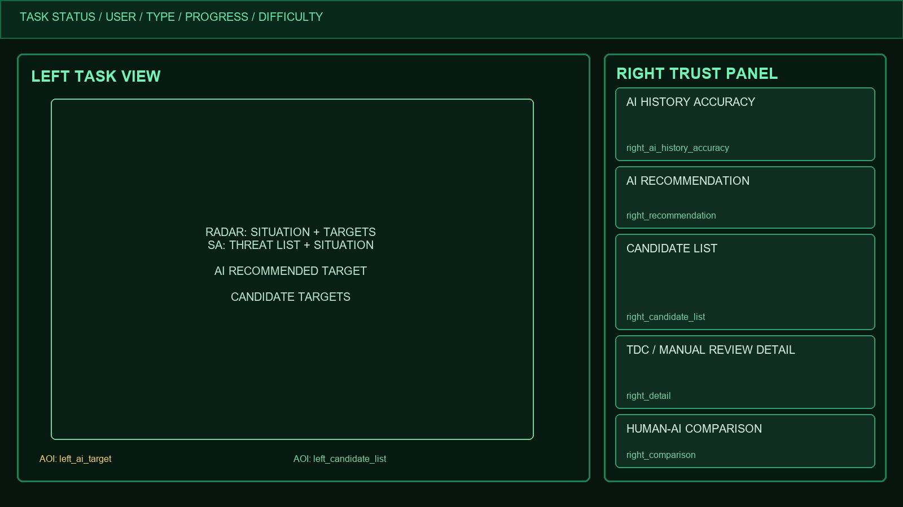

@title:信任调控界面设计
@subtitle:开发说明
@tagline:UI设计 · 数据存储 · 接口协议 · 指标计算 · 验证方法
@source:对应文档：《信任调控界面设计》

# 文档信息

| 项目 | 内容 |
|---|---|
| 文档版本 | V1.0 |
| 编制日期 | 2026年7月21日 |
| 适用系统 | F18-Radar信任调控实验平台 |
| 适用任务 | 传感器控制RADAR_TARGETING；威胁排序SA_THREAT_ASSESSMENT |
| 实现基线 | 当前工作区源码与已实现WebSocket和数据库协议 |
| 源文档处理 | 新建开发说明，不覆盖原《信任调控界面设计》 |

::: info | 阅读约定 | “已实现”表示当前代码存在完整链路；“修订”表示相对原设计的统一调整；“缺口”表示原需求尚未由现有结构完整覆盖。

# 修订记录

| 版本 | 日期 | 主要内容 | 状态 |
|---|---|---|---|
| V1.0 | 2026年7月21日 | 首次形成与设计文档逐项对应的开发说明，覆盖UI、数据、接口、AOI、指标和验收。 | 当前版 |

# 目录

1. 文档目标与设计对应关系
2. 总体架构与试次边界
3. 信任度量与界面模式
4. UI设计与任务阶段
5. 操杆、TDC与人工复核交互
6. 数据存储设计
7. 接口与消息协议
8. 动态AOI与眼动统计
9. 指标计算口径
10. RADAR与SA端到端时序
11. 异常、幂等与数据质量
12. 设计需求追踪与待确认项
13. 附录

---PAGE---

# 1 文档目标与设计对应关系

本说明把《信任调控界面设计》中的任务目标、界面阶段、信任分类和采集指标转换为可开发、可存储、可联调、可验收的工程规格。源文档回答“为什么调控、采什么数据”；本说明回答“界面何时出现、数据从哪里来、经过什么接口、存到哪里、如何复算”。

## 1.1 源设计与当前实现的对应

| 源设计内容 | 当前开发落点 | 状态 |
|---|---|---|
| 2.1传感器控制任务 | RADAR_TARGETING页面、雷达候选目标、AI推荐观测、TDC详情、IFF与结果确认。 | 已实现 |
| 2.2威胁排序任务 | SA_THREAT_ASSESSMENT页面、完整威胁列表、AI推荐观测、TDC详情、查看结果与确认。 | 已实现 |
| 图4与图7：修改界面1 | AI推荐出现后，右侧固定显示历史准确率、推荐观测、候选列表和当前详情。 | 修订映射 |
| 图5与图8：修改界面2 | 仅当人工选择与AI推荐不一致时，右侧自动显示人机观测对比。 | 修订映射 |
| 可靠性、置信度、可解释性 | 可靠性改为同条件AI历史识别准确率；解释优先展示原始观测；不公开预设AI等级可靠率。 | 修订 |
| 人工复核与查看时长 | 操杆实体第3键按下与松开形成一个复核时段；对象固定为AI推荐目标。 | 已实现 |
| 各区域眼动数据 | 七类动态分析AOI、版本快照、逐帧aoi_hits、离线I-VT统计。 | 已实现 |
| 每试次信任量表评分 | 现有questionnaire_responses绑定任务或任务组，但尚未确认每试次强制弹出并与trial_id一一对应。 | 缺口 |

::: info | 统一修订原则 | 欠信任和过度信任使用同一trust_support界面。系统不向参与者显示“欠信任”或“过度信任”标签，也不使用“错误、偏离、请纠正”等诱导措辞。

## 1.2 开发边界

- 复用现有任务组、任务执行、WebSocket、操杆、Tobii和问卷基础设施。
- 第1键继续选择或锁定；第2键继续查看结果、IFF、确认和任务推进；实体第3键只用于人工复核；第7键与副轴保持原逻辑。
- 不设置timeout规则；完成耗时按真实开始和完成时间计算，不因耗时长自动判失败。
- 不显示内部enemy或friend ID、敌我真值、威胁评分、计算过程或模拟AI日志。
- 正式实验不让旧信任校准状态参与当前统一模式判断。
- 所有参与者可见证据必须来自真实任务数据或任务快照，不生成虚构解释。

# 2 总体架构与试次边界



## 2.1 标识与生命周期

| 标识 | 含义 | 使用规则 |
|---|---|---|
| task_group_id | 一次实验任务组 | 同一组内累计同条件信任历史与整体完成耗时；新任务组重新累计。 |
| task_id | 一次具体任务执行 | 每次真实执行唯一；RADAR或SA重试使用新ID；重复的同一启动消息保持幂等。 |
| trial_id | 信任试次标识 | 当前实现通常与task_id对齐，用于串联推荐、选择、复核、AOI与结算。 |
| trial_sequence | 组内试次顺序 | 用于显示和追踪，不代替唯一标识。 |
| gaze_session_id | 眼动采集会话 | 区分同一任务下眼动服务重新连接或重启的采集会话；不能代替task_id。 |
| event_id | 过程事件唯一标识 | 客户端生成，便于幂等和重放排查。 |

::: warn | 关键边界 | task_id重复不是正常的“同一任务多次执行”表示方式。一次执行必须一个task_id；gaze_session_id只解决眼动采集会话边界，不能掩盖任务标识复用。

## 2.2 同条件历史键

condition_key由task_group_id、task_type、difficulty、ai_level四项组成。

user_id仍保存在试次结果中，但同一task_group_id已对应当前参与者实验上下文，因此不在条件键中重复匹配。传感器控制与威胁排序、不同难度、不同AI等级之间互不串用历史。

## 2.3 数据闭环的职责分工

| 层级 | 主要职责 | 不应承担的职责 |
|---|---|---|
| 前端任务页 | 呈现任务数据、采集TDC与操杆动作、形成过程事件、提交最终选择。 | 不直接判定信任分类，不伪造真值。 |
| 服务端任务编排 | 创建任务标识、下发历史、校验任务快照、结算信任结果、推进任务。 | 不从眼动或复核行为推断信任分类。 |
| 任务数据库 | 保存任务、过程事件、信任结算和问卷。 | 不保存逐帧原始眼动。 |
| GazeService | 保存AOI版本和逐帧眼动命中。 | 不触发信任支持，不改变任务选择。 |
| 离线统计 | 从原始帧与快照复算注视、访问和扫视指标。 | 不覆盖原始权威数据。 |

---PAGE---

# 3 信任度量与界面模式

## 3.1 试次信任分类

accepted_ai表示human_final_selection与ai_recommendation是否相同。

| AI推荐是否正确 | 人工是否接受AI | 试次结果 | 解释 |
|---|---|---|---|
| 正确 | 是 | appropriate | 正确接受 |
| 正确 | 否 | under_trust | 拒绝正确推荐 |
| 错误 | 否 | appropriate | 正确拒绝 |
| 错误 | 是 | over_trust | 接受错误推荐 |

分类由服务端在试次结算时生成。服务端使用任务快照校验AI实际推荐、人工最终选择和真值，前端不直接决定trust_outcome。

::: info | 不参与分类的数据 | TDC聚焦、详情查看、人工复核、目标切换、眼动、决策时间和整体完成耗时只用于过程与绩效分析，不改变适当信任、欠信任或过度信任分类。

## 3.2 历史统计与首次试次

appropriate_rate等于Nappropriate除以Nvalid_trials。under_trust_rate和over_trust_rate采用相同分母。direction_index等于Nunder_trust减Nover_trust后再除以Nvalid_trials。AI历史识别准确率等于同条件当前试次前AI正确试次数除以有效已结算试次数。

- Nvalid_trials只包含同时取得AI推荐、人工最终选择和任务真值的已结算试次。
- 统计只使用当前试次之前的同条件历史；当前结算只影响下一次同条件试次。
- 无历史时history_count等于0，ui_mode等于standard，准确率显示“暂无历史（0次）”。
- 首次试次仍按真实结果结算；不是把首次结果强制记为appropriate。
- AI历史识别准确率只作参与者信息与分析指标，不控制trust_outcome或ui_mode。
- 曲线显示最近最多12个累计准确率点，同时显示正确次数与有效次数，例如75%（3/4）。

## 3.3 界面模式

| 历史状态 | ui_mode | 下一试次界面 |
|---|---|---|
| 无同条件历史 | standard | 标准界面，history_count等于0。 |
| 历史全部appropriate | standard | 标准界面。 |
| 历史出现under_trust或over_trust | trust_support | 统一信任支持界面。 |

某条件触发trust_support后，在当前任务组内后续同条件试次持续使用该模式。欠信任与过度信任的UI完全一致，避免通过不同视觉反向暴露系统对参与者的评价。

## 3.4 试次前后数据边界

| 时间点 | 允许读取的数据 | 不能读取的数据 |
|---|---|---|
| 试次开始 | 当前条件的已结算历史、当前任务快照。 | 当前试次尚未产生的真值结果和信任结算。 |
| AI推荐出现 | AI实际推荐、候选数据、推荐时原始观测快照。 | 人工最终选择。 |
| 选择与确认期间 | TDC、复核、选择变化、对比暴露。 | 未来试次历史。 |
| 结果确认 | AI推荐、人工最终选择、任务真值。 | 未经服务端校验的分类结果。 |
| 结算完成 | 写入outcome并更新后续同条件历史。 | 回改本试次启动时保存的history_before。 |

# 4 UI设计与任务阶段



## 4.1 总体布局

界面由顶部任务状态栏、左侧任务主视图和右侧统一信任信息面板组成。RADAR与SA复用相同的右侧组件顺序和事件模型；两种ui_mode的组件数量、字段顺序和AOI结构保持一致。

| 区域 | 组件 | 显示内容 | 主要数据来源 |
|---|---|---|---|
| 右侧顶部 | AI历史识别准确率 | 最近最多12个累计准确率点、当前百分比、正确数与有效数；首次为暂无历史。 | trust_control.ai_history字段 |
| 右侧推荐 | AI推荐观测 | 匿名目标编号与原始观测快照；AI推荐出现后显示。 | 当前任务AI实际选择与推荐时快照 |
| 右侧列表 | 候选目标观测列表 | 候选编号与最小必要原始字段；标记AI推荐项。 | 当前任务候选快照 |
| 右侧详情 | TDC聚焦或人工复核详情 | 普通时展示TDC聚焦对象；复核时固定展示AI推荐快照。 | TDC状态或复核会话 |
| 右侧底部 | 人机选择观测对比 | 人机不一致时并列展示AI推荐与人工选择的原始观测。 | AI推荐与人工选择 |
| 左侧目标 | AI推荐目标 | 主视图中的推荐目标边界；支持注意提示与人工复核闪烁。 | 推荐目标当前屏幕几何 |
| 左侧候选 | 候选目标或威胁区 | RADAR候选显示区或SA完整威胁列表。 | 任务DOM容器边界 |

## 4.2 standard与trust_support的差异

| 项目 | standard | trust_support |
|---|---|---|
| 布局、组件、字段与AOI | 固定。 | 与standard完全相同。 |
| AI推荐注意提示 | 不主动启动。 | 推荐出现后在左侧目标显示中性辉光；TDC聚焦推荐或试次完成时结束。 |
| 右侧显著性 | 中性等权层级。 | 关键证据、数据新鲜度和替代候选提高显著性，但不新增字段。 |
| 人工复核闪烁 | 实体第3键按住期间闪烁。 | 同样按住期间闪烁；若原注意提示存在则切换为复核闪烁。 |
| 参与者可见状态名 | 不显示。 | 不显示“信任支持”“欠信任”或“过度信任”。 |

## 4.3 原图4、图5、图7、图8的运行时对应阶段

| 源图 | 任务 | 运行时出现阶段 | 当前规则 |
|---|---|---|---|
| 图4 | 传感器控制 | AI推荐出现后 | 显示准确率、推荐观测、候选列表；TDC或复核驱动详情。 |
| 图5 | 传感器控制 | 人工选择与AI推荐不一致后 | 自动显示人机观测对比；一致时不得显示。 |
| 图7 | 威胁排序 | sa_task_updated提供完整数据且AI推荐可用后 | 与RADAR使用同一组件结构，字段改为SA原始任务数据。 |
| 图8 | 威胁排序 | 人工选择与AI推荐不一致后 | 自动显示中性对比；不得出现“一致但提示偏离”。 |

::: info | 交互删减 | 没有独立“查看详情”“人工复核”“复核对比”“展开全部”鼠标按钮。查看详情由TDC聚焦自动触发，复核由操杆实体第3键触发，对比由人机不一致自动触发。原任务中的“查看结果”保留。

## 4.4 两类任务的原始证据字段

| 任务 | 推荐与详情字段 | 结果确认前禁止展示 |
|---|---|---|
| RADAR | 目标编号、方位、距离、速度原始值、航向、相对航向、数据时间；需要时显示天线相关原始量。 | 内部目标ID、敌我真值、威胁评分、置信度结论、计算过程。 |
| SA | 目标编号、威胁类别的中性任务描述、目标特征或来源标签、中心距离、显示坐标、数据时间。 | 内部目标ID、敌我真值、虚构解释、未由任务数据提供的置信度或理由。 |

匿名编号在目标首次出现时按方位排序，方位相同时按距离排序；目标移动后编号保持稳定。AI推荐、TDC详情、人工复核和人机对比必须使用同一编号映射。

## 4.5 右侧组件的显隐状态

| 组件 | 无推荐 | 有推荐未聚焦 | TDC聚焦 | 人工复核 | 人机不一致 |
|---|---|---|---|---|---|
| 历史准确率 | 显示历史或暂无历史。 | 显示。 | 显示。 | 显示。 | 显示。 |
| 推荐观测 | 空状态。 | 显示AI推荐。 | 显示AI推荐。 | 显示AI推荐。 | 显示AI推荐。 |
| 候选列表 | 根据任务数据显示。 | 显示并标注AI项。 | 同前。 | 同前。 | 同前。 |
| 详情 | empty。 | empty。 | tdc_detail。 | manual_review且绑定AI推荐。 | 由TDC或复核状态决定。 |
| 对比 | 隐藏。 | 隐藏。 | 根据人工选择判断。 | 根据人工选择判断。 | comparison且可见。 |

# 5 操杆、TDC与人工复核交互

## 5.1 按键语义

| 实体按键 | 后端原始字段 | 前端语义 | 功能 |
|---|---|---|---|
| 第1键 | buttons.button0 | button1 | SA选择目标；RADAR锁定目标；形成明确人工选择。 |
| 第2键 | buttons.button1 | button2 | SA查看结果、确认和推进；RADAR执行IFF及相关确认。 |
| 第3键 | buttons.button2 | button3 | 按下开始、松开结束AI推荐目标的人工复核。 |
| 第7键 | 现有字段 | button7 | 保持当前代码行为，不纳入信任调控。 |
| 副轴 | 轴数据 | subY等 | 保持天线控制行为。 |

::: warn | 命名说明 | 操杆库使用零基索引，所以实体第3键由后台原始buttons.button2推送；前端将它转换为语义button3。协议、日志和测试必须同时写明“实体键”和“原始字段”，避免再次误映射。

## 5.2 TDC自动详情

TDC进入候选目标半径，连续聚焦达到focus_dwell_ms后产生detail_shown；TDC离开后产生detail_hidden并结算duration_ms。

- RADAR默认聚焦半径30像素；SA默认40像素；默认驻留150毫秒。
- TDC聚焦表示浏览，不表示选择；只有实体第1键形成human_selection_changed。
- 移动到另一候选对象时更新right_detail的target_id和原始观测快照。
- 详情暴露时长从detail_shown到detail_hidden累计，试次结束时强制关闭未结束的详情时段。
- 不设置“查看详情”按钮，不设置“展开全部”按钮。

## 5.3 人工复核状态机

| 状态与触发 | 界面行为 | 事件与统计 |
|---|---|---|
| Button3上升沿且存在AI推荐 | 固定复核对象为按下时AI推荐；目标开始中性辉光闪烁；右侧显示推荐时原始观测快照。 | manual_review_started；有效次数加1；生成review_session_id。 |
| Button3保持按下 | 持续闪烁；不改变TDC、锁定目标或最终选择。 | 不重复计数，不重复发开始事件。 |
| Button3下降沿 | 立即停止闪烁；右侧恢复普通TDC详情。 | manual_review_ended；duration等于结束减开始；累加查看时长。 |
| 无AI推荐时按下 | 不进入复核状态，不闪烁。 | manual_review_ignored；原因no_ai_recommendation；无效次数加1。 |
| 试次、任务、用户变化、推荐失效、断杆或卸载 | 强制停止复核显示。 | 使用实际结束时间写ended和end_reason。 |

查看时长定义为实体第3键有效按下至松开或强制结束的累计时间。眼动注视时长仍独立计算，可用同一trial_id与时间轴分析“复核期间实际看了哪个AOI”。

人工复核期间展示的观测快照必须是AI作出推荐时保存的原始数据，避免目标运动后证据发生变化。复核对象不跟随TDC移动，也不切换到人工选择目标或次优候选。

## 5.4 人机对比

comparison_visible成立的条件是human_selection已经存在，且human_selection与ai_recommendation不同。

- 不一致时自动显示right_comparison，并记录comparison_shown。
- 人工重新选择为AI推荐时隐藏，并记录comparison_hidden与暴露时长。
- 试次完成时强制隐藏；一致时不得保留面板。
- 并列展示双方原始观测，不给出“错误、偏离、请纠正”的判断。
- 不设置“复核对比”按钮。

---PAGE---

# 6 数据存储设计

## 6.1 存储分层

| 存储 | 主要内容 | 权威用途 |
|---|---|---|
| server/data/radar_operations.db | 任务组、任务执行、过程事件、信任试次结算、问卷等。 | 任务与信任结果主库 |
| GazeService的gaze_records.db | AOI区域版本、有效区间、显示参数、几何和语义绑定。 | AOI快照主库 |
| 每任务raw_gaze.jsonl | 逐帧时间、gaze坐标、旧提醒hit与hits、分析aoi_revision与aoi_hits。 | 眼动原始帧权威源 |
| 离线分析JSON与CSV | 注视、访问、扫视路径、转移矩阵、质量统计与算法版本。 | 可复算派生结果 |

## 6.2 任务与信任表

| 表 | 关键字段组 | 说明 |
|---|---|---|
| task_groups | id、user_id、task_type、started_at、completed_at、status | 实验任务组；用于整体耗时和完成率。 |
| task_runs | task_id、task_group_id、task_seq、status、started_at、completed_at、raw_config与raw_message | 每次具体执行一行；一次执行一个task_id。 |
| task_events | event_id、task_id或trial_id、task_group_id、task_type、ui_mode、event_type、target_id、timestamp、extra | TDC、复核、对比、选择、完成等过程事件。 |
| trust_trial_outcomes | 条件键、AI或人工或真值、正确性、信任分类、模式与历史、关键时间、复核汇总 | 一试次一行，trial_id唯一；服务端结算。 |
| questionnaire_responses | user_id、task_id、task_group_id、task_type、difficulty、autonomy_level、responses | 当前问卷存储；是否满足每试次信任评分见第12章。 |

## 6.3 trust_trial_outcomes字段分组

| 字段组 | 字段 | 来源或生成者 |
|---|---|---|
| 标识与条件 | trial_id、task_id、task_group_id、user_id、trial_sequence、task_type、difficulty、ai_level | 任务上下文，服务端校验。 |
| 三元决策数据 | ai_recommendation_json、human_final_selection_json、ground_truth_json | 任务快照与前端最终选择。 |
| 分类结果 | ai_correct、human_correct、accepted_ai、trust_outcome | 服务端trust_control。 |
| 试次前历史 | ui_mode、history_count、三类信任率、direction_index、AI历史准确率与计数 | 试次启动时快照。 |
| 时间 | task_started_at_ms、ai_recommendation_shown_at_ms、final_selection_confirmed_at_ms、trial_completed_at_ms | 服务端与前端关键事件。 |
| 复核汇总 | manual_review_used、manual_review_count、manual_review_duration_ms、invalid_review_count | task_events汇总后结算。 |

::: info | 幂等 | trust_trial_outcomes的trial_id唯一；重复结算使用INSERT OR IGNORE或等价幂等逻辑，不得重复累计历史。task_events依赖event_id唯一性和上层去重规范。

## 6.4 gaze_aoi_snapshots字段

| 字段 | 含义 |
|---|---|
| snapshot_id | 服务端快照唯一ID。 |
| task_id、trial_id、task_group_id、task_type | 与任务和试次关联。 |
| revision | 同一任务内递增版本；task_id与revision组合唯一。 |
| valid_from_us与valid_to_us | 快照在服务端时间轴上的生效区间；新快照关闭旧区间。 |
| layout_signature | 量化后几何、可见性、语义绑定和显示参数的签名，用于去重。 |
| display_json与coordinate_space | 全屏、视口、屏幕、DPR、缩放和坐标空间。 |
| regions_json | 七个AOI的矩形边界、visible和binding。 |
| alignment_valid | 是否允许据此生成aoi_hits。 |
| client_snapshot_id、client_captured_at_ms、created_at | 客户端关联、延迟排查和服务端落库时间。 |

## 6.5 数据落库时序

1. task_groups建立实验组，并记录started_at。
2. task_runs为每次实际执行创建唯一task_id。
3. 试次开始时只读取当前条件已结算outcomes。
4. 前端过程动作通过trust_trial_event进入task_events。
5. 结果确认时服务端校验任务快照，写入唯一trust_trial_outcome并完成task_run。
6. 任务组最后一次执行完成后更新task_groups.completed_at。
7. AOI快照与眼动帧并行进入GazeService存储，任务结束时关闭最后一个快照。
8. 离线统计不修改原始库和raw_gaze.jsonl，只生成派生结果。

---PAGE---

# 7 接口与消息协议

信任调控不新增独立REST业务接口，复用现有WebSocket任务通道和任务确认流程。AOI快照由WebSocket提交；HTTP服务仅保留同类消息兼容入口。

## 7.1 接口总表

| 方向 | 消息或接口 | 用途 | 响应或存储 |
|---|---|---|---|
| 服务端到前端 | init_settings.trust_control | RADAR试次开始时下发同条件历史与ui_mode。 | 前端初始化统一面板 |
| 服务端到前端 | sa_task_updated.trust_control | SA数据完整更新后下发同条件历史与ui_mode。 | 前端初始化统一面板 |
| 服务端到前端 | joystick_data.data.buttons | 推送原始按键状态；buttons.button2代表实体第3键。 | 前端边沿检测 |
| 前端到服务端 | trust_trial_event | 保存推荐、辉光、TDC、详情、复核、选择、对比和完成过程。 | task_events |
| 前端到服务端 | task_result_confirmed.extra.trust_trial | 沿原第2键流程确认结果并提交信任结算所需数据。 | task_runs与trust_trial_outcomes |
| 前端到GazeService | tobii_aoi_snapshot | 提交动态分析AOI版本。 | gaze_aoi_snapshots |
| GazeService到前端 | tobii_aoi_snapshot_result | 回传revision、changed和服务端snapshot_id。 | 前端确认与重连同步 |
| 前端到GazeService | tobii_hand | 旧注意力提醒区域。 | 只影响attention_regions和hit与hits |

## 7.2 试次开始trust_control

```json
{
  "trust_control": {
    "condition_key": {
      "task_group_id": 8,
      "task_type": "RADAR_TARGETING",
      "difficulty": "low",
      "ai_level": "L2"
    },
    "history_count": 4,
    "ui_mode": "trust_support",
    "appropriate_rate": 0.50,
    "under_trust_rate": 0.25,
    "over_trust_rate": 0.25,
    "direction_index": 0.0,
    "ai_history_accuracy": 0.75,
    "ai_history_correct_count": 3,
    "ai_history_valid_count": 4,
    "disclose_ai_reliability": false
  }
}
```

SA任务在sa_task_updated之前没有完整候选、AI推荐和真值上下文，因此不应提前计算或显示该试次的有效历史曲线；收到有效sa_task_updated后再初始化。

## 7.3 过程事件trust_trial_event

```json
{
  "type": "trust_trial_event",
  "event_type": "manual_review_started",
  "event_id": "uuid",
  "trial_id": "42",
  "task_id": "42",
  "task_group_id": "8",
  "trial_sequence": 2,
  "task_type": "RADAR_TARGETING",
  "user_id": "P001",
  "ui_mode": "trust_support",
  "target_id": "enemy-3",
  "timestamp": 1779250000123,
  "extra": {
    "review_session_id": "uuid",
    "joystick_button": 3,
    "display_target_number": 3,
    "observation_snapshot": {
      "azimuth_deg": 9.0,
      "distance_nm": 61.3,
      "speed_raw": 3.5,
      "heading_deg": 75.1,
      "relative_heading_deg": 157.1,
      "data_time": "20:43:38.954"
    }
  }
}
```

target_id在协议和数据库中用于稳定关联，参与者界面只显示匿名编号。observation_snapshot必须来自AI作出推荐时保存的原始任务数据。

## 7.4 试次确认task_result_confirmed

```json
{
  "type": "task_result_confirmed",
  "task_id": "42",
  "extra": {
    "trust_trial": {
      "trial_id": "42",
      "trial_sequence": 2,
      "ai_recommendation": {"id": "enemy-3"},
      "human_final_selection": {"id": "enemy-2"},
      "ground_truth": {"id": "enemy-2"},
      "ai_recommendation_shown_at_ms": 1779250000000,
      "final_selection_confirmed_at_ms": 1779250008120,
      "manual_review_used": true,
      "manual_review_count": 1,
      "manual_review_duration_ms": 1260,
      "invalid_review_count": 0
    }
  }
}
```

服务端不能直接信任前端ground_truth或AI推荐字段；必须回查本次task_id的任务快照，验证三元数据后再生成ai_correct、human_correct、accepted_ai和trust_outcome。

## 7.5 AOI快照协议

```json
{
  "type": "tobii_aoi_snapshot",
  "task_id": "42",
  "trial_id": "42",
  "task_group_id": "8",
  "task_type": "RADAR_TARGETING",
  "client_snapshot_id": "uuid",
  "captured_at_ms": 1779250000000,
  "change_reasons": ["geometry_changed"],
  "layout_signature": "sha256...",
  "coordinate_space": "display_area_normalized",
  "display": {
    "fullscreen": true,
    "alignment_valid": true,
    "viewport_width_css_px": 1920,
    "viewport_height_css_px": 1080,
    "screen_width_css_px": 1920,
    "screen_height_css_px": 1080,
    "device_pixel_ratio": 1,
    "visual_viewport_scale": 1
  },
  "regions": [
    {
      "id": "right_detail",
      "shape": "rect",
      "visible": true,
      "left": 0.68,
      "top": 0.64,
      "right": 1.0,
      "bottom": 0.77,
      "binding": {"mode": "manual_review", "target_id": "enemy-3"}
    }
  ]
}
```

```json
{
  "type": "tobii_aoi_snapshot_result",
  "ok": true,
  "task_id": "42",
  "snapshot_id": "server-uuid",
  "revision": 7,
  "changed": true,
  "layout_signature": "sha256...",
  "client_snapshot_id": "uuid"
}
```

服务端接收时间作为快照valid_from_us的生效时间；captured_at_ms只用于检查传输延迟。相同签名重复提交时changed为false，不新增数据库记录。

---PAGE---

# 8 动态AOI与眼动统计

## 8.1 七类分析AOI

| AOI ID | 边界来源 | binding语义 | 可见性 |
|---|---|---|---|
| left_ai_target | 左侧AI推荐目标实际DOM或绘制外接矩形 | target_id；无推荐时为null | 无有效推荐边界时false |
| left_candidate_list | RADAR候选显示区或SA完整威胁列表容器 | candidate_ids | 空状态容器也可为true |
| right_ai_history_accuracy | 右侧顶部准确率曲线容器 | metric等于ai_history_accuracy | 面板存在时true |
| right_recommendation | AI推荐观测组件 | target_id | 组件可见；无推荐时target_id为null |
| right_candidate_list | 右侧候选观测列表 | candidate_ids | 容器存在时true |
| right_detail | TDC或人工复核详情组件 | mode与target_id | 容器存在时true |
| right_comparison | 人机对比组件 | mode与ai和human目标ID | 仅内容实际显示时true |

::: info | 为何是七类 | 早期方案把AI历史识别准确率包含在推荐区域中。当前UI已将曲线移到右侧顶部独立区域，因此新增right_ai_history_accuracy，六区口径升级为七区。

binding不是屏幕内容本身，而是该几何区域在此版本代表的业务对象。例如right_detail的target_id为null且mode为empty，表示详情容器可见但当前没有绑定目标；不能把null解释为存储失败。

## 8.2 何时生成新快照

| 触发测量 | 真正写新版本的条件 |
|---|---|
| 试次首次稳定渲染、页面切换、推荐变化、TDC目标变化、复核开始或结束、对比显隐、候选空或有变化 | 几何至少变化1个物理像素，或visible变化，或binding语义变化。 |
| ResizeObserver、MutationObserver、scroll、resize、fullscreen、DPR或visualViewport变化 | 显示参数或alignment_valid变化。 |
| WebSocket重连 | 重新同步当前布局；签名相同则服务端changed为false，不新增记录。 |
| 辉光颜色、透明度、阴影、闪烁动画、准确率数值变化 | 不写新版本，除非实际边界或语义变化。 |

前端等待连续两个动画帧测得相同边界后发送；持续移动时最迟100毫秒发送最新快照；频率不超过每秒10次。所有区域按ID排序，边界量化到物理像素后计算layout_signature，前端和服务端双重去重。

## 8.3 全屏与坐标有效性

正式实验要求innerWidth接近screen.width，innerHeight接近screen.height，screenX与screenY接近0，visualViewport.scale等于1，允许误差不超过2个物理像素。

验证失败时仍保存alignment_valid为false的快照和原始gaze坐标，但暂停生成aoi_hits；恢复全屏或缩放后生成新快照并恢复命中计算。AOI与Tobii统一使用整屏归一化坐标。

## 8.4 逐帧记录

```json
{
  "ts_us": 1779250000000000,
  "gaze": [0.421, 0.913],
  "hit": true,
  "hits": ["antenna_prompt"],
  "aoi_revision": 7,
  "aoi_hits": ["left_ai_target", "left_candidate_list"]
}
```

| 字段 | 含义 |
|---|---|
| hit与hits | 旧注意力提醒区域命中，只由attention_regions或tobii_hand决定。 |
| aoi_revision | 当前任务对应的分析AOI版本。 |
| aoi_hits | 该帧命中的全部分析AOI；空数组表示有有效快照但未命中。 |
| 无aoi_hits字段 | 没有有效AOI快照或alignment无效；必须结合快照质量判断。 |

::: warn | 严格分离 | 分析AOI不触发原注意力提醒；tobii_hand不修改分析AOI。不得用一个布尔hit代替aoi_hits，也不得用分析区域覆盖gaze_targets。

## 8.5 离线统计

原始raw_gaze.jsonl与gaze_aoi_snapshots是权威源。默认分析窗口为ai_recommendation_shown到final_selection_confirmed；试次结束后使用server/statistics/aoi_gaze_statistics.py离线计算。

| 项目 | 默认口径 |
|---|---|
| 注视算法 | I-VT；速度阈值30度每秒；最短注视100毫秒。 |
| 时间积分 | 相邻采样间隔积分；单段最大计100毫秒；超过100毫秒无效间隔切断当前注视。 |
| 多AOI命中 | 保留全部aoi_hits；单一归属优先面积最小的具体区域，必要时按固定优先级。 |
| 注视跨AOI | 按持续时间占比最高的AOI归属，同时保留原始命中明细。 |
| 输出 | 各AOI有效采样、注视时长和次数、首次进入、访问次数与顺序、扫视路径、转移矩阵、有效帧比例、异常时长。 |
| 可复算 | 结果文件记录算法版本与全部阈值，支持再次从原始数据生成JSON和CSV。 |

# 9 指标计算口径

| 原设计指标 | 计算口径 | 数据源 |
|---|---|---|
| 适当信任率 | Nappropriate除以Nvalid_trials后乘100%。 | trust_trial_outcomes |
| 欠信任率 | Nunder_trust除以Nvalid_trials后乘100%。 | trust_trial_outcomes |
| 过度信任率 | Nover_trust除以Nvalid_trials后乘100%。 | trust_trial_outcomes |
| AI历史识别准确率 | 同条件当前试次前Nai_correct除以Nvalid_trials后乘100%。 | trust_trial_outcomes |
| 是否修改AI锁定目标 | 最终人工选择是否不同于AI推荐；也可结合选择事件序列。 | outcomes与task_events |
| 目标切换个数 | human_selection_changed的有效目标变化次数。 | task_events |
| 是否人工复核 | 至少存在一次manual_review_started。 | task_events或outcome汇总 |
| 人工复核点击次数 | manual_review_started数量；无效按压另计。 | task_events |
| 人工复核查看时长 | 各manual_review_ended的duration_ms之和。 | task_events或outcome汇总 |
| AI推荐至人工锁定犹豫时长 | final_selection_confirmed_at_ms减ai_recommendation_shown_at_ms。 | trust_trial_outcomes |
| 人工准确率 | 人工最终选择正确试次除以有效试次。 | trust_trial_outcomes |
| 任务组整体完成耗时 | task_group.completed_at减task_group.started_at。 | task_groups |
| 有效决策总耗时 | 组内全部有效试次决策耗时之和。 | trust_trial_outcomes |
| AOI注视与扫视 | 按第8.5节离线算法。 | raw_gaze与snapshots |
| 主观信任评分 | 应按每试次量表结果关联trial_id。 | 当前问卷表需确认或增强 |

::: info | 耗时解释 | 系统不设置超时判定。耗时长仍按真实值进入任务绩效分析；若后续实验要设置超时，必须另行定义阈值、状态、是否计入有效试次和强制结算规则。

## 9.1 统计分母与缺失数据

- 信任率和人工准确率的分母只包含有效结算试次。
- 缺少AI推荐、人工最终选择或任务真值的试次标记为无效，不进入三类信任率。
- 无效试次仍可保留过程事件和眼动数据，用于数据质量分析，但必须与有效绩效统计分开。
- 历史曲线按当前试次开始前的有效历史绘制，不能把正在进行的试次提前加入分母。
- 首次无历史使用null准确率而不是0%，界面显示“暂无历史（0次）”，避免把无数据误解为全错。

## 9.2 整体完成耗时与逐试次耗时

任务组整体完成耗时反映参与者完成整组任务的实际负担，包括浏览、复核、改选、结果确认和试次切换。单试次决策耗时反映从AI推荐出现到人工最终选择确认的决策阶段。二者必须同时保留，不能仅用逐试次耗时替代整体完成耗时。

为了分析界面是否导致用户挨个尝试而显著变慢，还应联合查看目标切换次数、TDC聚焦序列、详情暴露时长、人工复核次数、人机对比暴露时长、人工准确率和任务完成率。

# 10 RADAR与SA端到端时序

## 10.1 统一主流程

1. 服务端创建唯一task_id，按条件键查询已结算历史，生成trust_control。
2. RADAR通过init_settings、SA通过有效sa_task_updated下发任务与trust_control。
3. 前端渲染候选目标、准确率曲线、AI推荐与右侧列表；记录ai_recommendation_shown。
4. 若ui_mode为trust_support，左侧AI推荐目标开始中性注意辉光。
5. 用户移动TDC浏览；驻留满足阈值后自动更新right_detail并记录详情时段。
6. 用户可按住实体第3键复核AI推荐；推荐目标闪烁，松开后结算查看时长。
7. 用户用实体第1键选择或锁定；记录human_selection_changed。
8. 若人工选择与AI推荐不一致，自动显示right_comparison并记录暴露时段。
9. 用户使用实体第2键执行原查看结果、IFF或确认流程。
10. 前端提交task_result_confirmed.extra.trust_trial；服务端校验快照、结算信任并完成task_run。
11. 任务事件与眼动采集关闭；下一同条件试次读取本次已结算结果。

## 10.2 RADAR专属约束

- AI推荐必须是任务概率算法实际选中的目标，不能以排序第一项替代。
- 实体第1键继续锁定TDC附近目标；实体第2键继续IFF与相关确认。
- IFF前不得通过右侧原始证据泄露敌我真值。
- 副轴天线操作及其既有校验保持不变。
- 推荐、人工选择和真值必须由同一task_id任务快照校验。
- 目标移动时匿名编号保持稳定，但left_ai_target几何可产生新AOI版本。

## 10.3 SA专属约束

- sa_task_updated之前不计算当前试次准确率、不复用上一试次列表，也不启动本试次信任面板。
- sa_task_updated提供完整威胁数据后，候选列表、AI实际选择、真值与历史才进入本试次上下文。
- 实体第1键继续选择目标；实体第2键继续查看结果、确认和推进。
- SA人工复核与RADAR一样必须让AI推荐对象产生辉光闪烁，并记录完整开始与结束时段。
- 左侧left_candidate_list覆盖完整威胁列表，包括有数据和空状态容器。
- AI推荐使用算法实际概率选择结果，不能默认等于威胁评分第一项。


# 11 异常、幂等与数据质量

| 场景 | 处理规则 | 验证点 |
|---|---|---|
| 重复任务启动 | 相同活动任务请求幂等返回；真实重试创建新task_id。 | task_runs不出现一次执行多行或多次执行同ID。 |
| 重复试次结算 | trial_id唯一，重复确认不重复插入或累计。 | trust_trial_outcomes只有一条。 |
| 过期确认 | task_result_confirmed必须匹配当前活动task_id；过期消息忽略。 | 不关闭新任务。 |
| 无AI推荐按Button3 | 记录manual_review_ignored，不闪烁、不计有效次数。 | invalid_review_count增加。 |
| Button3未松开即结束 | 强制写manual_review_ended和实际duration。 | 无悬空复核时段。 |
| AOI重复签名 | 服务端返回changed为false，不新增revision。 | 不出现task_id与revision唯一约束冲突。 |
| AOI新版本 | 同一事务计算下一revision并关闭旧valid_to_us。 | 版本单调、区间不重叠。 |
| 非全屏或缩放异常 | 保存无效快照、保留原始gaze、暂停aoi_hits。 | alignment_valid为false。 |
| WebSocket重连 | 重发当前AOI；签名去重；任务状态不能回退。 | 无重复快照或旧任务污染。 |
| 数据库写入失败 | 记录结构化错误和task_id与event_id，不静默吞掉。 | 可从日志定位消息与表。 |

## 11.1 时间基准

业务事件使用毫秒时间戳；眼动帧和AOI有效区间使用微秒。AOI快照以服务端接收时间valid_from_us生效，客户端captured_at_ms只用于传输延迟分析。离线合并时统一换算到微秒，并以task_id或trial_id限定范围。

## 11.2 数据质量最低要求

- 一个试次必须能够从task_run关联到唯一trust_trial_outcome。
- 每个manual_review_started应有同review_session_id的ended；强制结束也算闭合。
- 每个raw gaze帧的aoi_revision应能在相同task_id下关联快照；无效对齐期间除外。
- 正式实验使用全屏、缩放1、固定显示器；异常时间必须可量化。
- 所有参与者可见证据必须可追溯到任务快照，不能由前端临时生成结论。
- 同一任务只有一个未关闭AOI快照，任务完成后必须关闭最后一个valid_to_us。
- 试次历史只读取已结算数据，不能读取仅有过程事件而无outcome的试次。

## 11.3 AOI唯一约束冲突的防护

gaze_aoi_snapshots中task_id与revision组合唯一。服务端应在同一任务锁或数据库事务内读取当前最大revision、生成下一revision、关闭旧快照并插入新快照。前端重复上报由layout_signature去重；gaze_session_id不能作为规避task_id重复的替代键。若任务真正重试，应创建新task_id。


# 12 设计需求追踪与待确认项

## 12.1 原文“需要收集的数据”闭环

| 类别 | 原需求 | 当前闭环 | 结论 |
|---|---|---|---|
| 行为模式 | 修改AI目标、切换个数、适当信任率 | 选择事件、信任结算表与服务端分类。 | 已闭环 |
| 监督行为 | 人工复核、次数、查看时长 | Button3会话开始与结束，加汇总字段。 | 已闭环 |
| 反应时间 | AI推荐至人工锁定犹豫时长 | 两个关键时间戳相减。 | 已闭环 |
| 任务绩效 | 准确率、整体完成耗时 | outcomes人工正确性加task_groups起止时间。 | 已闭环 |
| 生理数据 | 各区域注视点、时长、次数、扫视路径 | 七AOI快照、raw gaze与离线统计。 | 已闭环 |
| 主观数据 | 每试次信任量表评分 | 存在问卷存储，但当前触发粒度和trial_id强绑定需要复核。 | 待确认 |

## 12.2 建议补齐项

| 优先级 | 项 | 原因与建议 |
|---|---|---|
| P0 | 每试次主观信任量表闭环 | 若实验必须每试次评分，确认UI触发点，并保证questionnaire_responses含唯一trial_id或task_id；不能只做任务组末问卷。 |
| P1 | 接口版本字段 | 为trust_control、trust_trial_event和tobii_aoi_snapshot增加protocol_version，便于数据长期复现。 |
| P1 | 数据字典枚举固化 | 固定task_type、ui_mode、trust_outcome、event_type和end_reason枚举，并在服务端拒绝未知值。 |
| P1 | 匿名编号映射持久化 | 将display_target_number与内部target_id映射写入任务快照或事件，保证离线报告可复核。 |
| P2 | 准确率小样本提示 | 继续显示正确数和有效数，避免把1/1的100%理解为稳定可靠性；不要显示预设可靠率。 |
| P2 | 数据保留策略 | 明确raw gaze、快照、任务库和导出结果的保存期限、脱敏和备份责任。 |

::: warn | 验收判定 | 只有能够从界面动作追到消息、从消息追到存储、从存储复算出指标，才算该原设计采集项闭环。仅在页面显示而未存储，或仅存最终布尔值而不能还原过程，均不算闭环。

## 12.3 当前设计与原设计的关键差异

| 项目 | 原设计可能理解 | 当前统一实现 |
|---|---|---|
| 欠信任与过度信任UI | 可能分别设计。 | 完全相同的trust_support，只表达“建议核查”。 |
| 第一次试次 | 可能默认适当。 | UI使用standard，但结算按真实结果。 |
| 查看详情 | 鼠标按钮或展开过程。 | TDC驻留自动展示，不离杆。 |
| 人工复核 | 独立界面按钮。 | 实体第3键按住期间复核AI推荐目标。 |
| 人机对比 | 手动按钮。 | 人机不一致时自动显示。 |
| 解释信息 | 计算结果或单一数字。 | 展示任务原始观测快照。 |
| AI可靠性 | 预设AI等级可靠率。 | 仅显示同条件已结算历史准确率与样本数。 |
| 眼动区域 | 静态区域或只有hit。 | 动态版本AOI、全部命中和有效区间。 |
| 超时 | 未定义。 | 不增加timeout字段和规则。 |

---PAGE---

# 附录A 事件字典

| event_type | 触发 | 关键extra |
|---|---|---|
| ai_recommendation_shown | AI推荐首次可见 | 候选数、匿名编号、observation_snapshot |
| glow_started与glow_ended | trust_support注意辉光开始或结束 | reason |
| tdc_focus_enter与leave | TDC进入或离开有效候选 | focused target与duration_ms |
| detail_shown与hidden | 详情可见或隐藏 | mode、target与duration_ms |
| manual_review_started | 实体第3键有效上升沿 | review_session_id、joystick_button为3、snapshot |
| manual_review_ended | 松开或强制结束 | started、ended、duration与end_reason |
| manual_review_ignored | 无AI推荐时按下 | reason为no_ai_recommendation |
| human_selection_changed | 实体第1键选择或锁定变化 | previous与current target |
| comparison_shown与hidden | 人机不一致出现、恢复一致或完成 | AI目标、人工目标与duration_ms |
| final_selection_confirmed | 最终选择确认 | final target与timing |
| trial_completed | 试次完成 | result summary |

人工复核强制结束的end_reason包括button_released、trial_completed、task_changed、user_changed、recommendation_invalidated、joystick_disconnected和page_unloaded。

# 附录B 代码实现索引

| 领域 | 主要文件 | 职责 |
|---|---|---|
| 右侧统一UI | src/components/TrustControlPanel.tsx | 准确率、推荐、候选、详情、对比组件与七AOI标记。 |
| 信任试次状态 | src/hooks/useTrustTrial.ts | 推荐、辉光、TDC、Button3复核、对比与结算数据。 |
| AOI观察器 | src/hooks/useTrustAoiSnapshot.ts | DOM测量、稳定帧、签名、快照上报与重连。 |
| 操杆映射与任务消息 | src/hooks/useRadarData.ts | 原始button0、button1、button2到语义button1、button2、button3；接收任务与AOI响应。 |
| RADAR页面 | src/components/Radar.tsx与RadarDisplay.tsx | 任务主视图、锁定、IFF、确认。 |
| SA页面 | src/components/SAPage.tsx | 威胁数据、选择、查看结果、确认。 |
| 服务端消息编排 | server/core/message_handler.py | 事件存储、结果确认、服务端校验与信任结算。 |
| 信任算法 | server/services/trust_control.py | 历史查询、分类、比率、模式、准确率序列。 |
| 任务数据库 | server/managers/database_manager.py | 任务、事件、outcome、问卷表和聚合查询。 |
| AOI服务 | server/tobii/gaze_service.py | 快照版本、逐帧命中与原始眼动写入。 |
| AOI协议入口 | server/network/websocket_server.py与http_server.py | tobii_aoi_snapshot接收与响应。 |
| 离线统计 | server/statistics/aoi_gaze_statistics.py | I-VT、AOI访问、扫视路径和质量输出。 |
| 现有AOI说明 | server/docs/dynamic_aoi_analysis.md | 动态AOI协议和验证细则。 |

# 附录C 最小联调检查单

- 首次同条件试次使用standard、history_count为0、准确率显示暂无历史。
- 首次适当后第二次仍standard；首次欠信任或过度信任后第二次均为trust_support。
- Button3的原始buttons.button2按下和松开在轴不动时也能推送。
- 人工复核只闪烁AI推荐目标；按住不重复计数；松开立即停止。
- TDC聚焦只查看，不改变人工选择；实体第1键才产生选择事件。
- 人机一致时无对比，不一致时自动对比，恢复一致后隐藏。
- task_result_confirmed重复发送不产生第二条outcome。
- 七个AOI的几何、visible和binding可以在数据库中按revision回放。
- 辉光或闪烁动画不连续新增AOI快照；语义目标变化会新增版本。
- 非全屏或缩放异常只暂停aoi_hits，不停止原始gaze。
- 任务组整体耗时、决策耗时、复核时长和AI历史准确率可由库中原始记录复算。
- RADAR与SA都不显示内部ID、敌我真值或虚构解释。
- 确认每试次主观信任量表是否已与trial_id一一对应。
- 确认旧信任校准逻辑不参与正式实验ui_mode。
- 确认public与dist实际运行配置一致，且不覆盖用户已有init_config修改。

文档结束。
