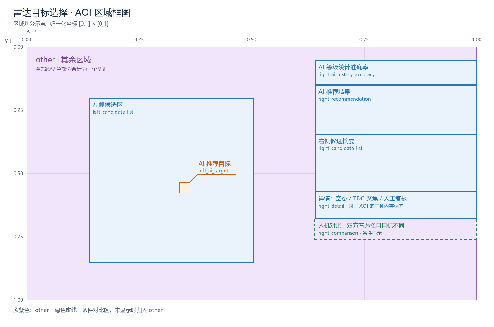
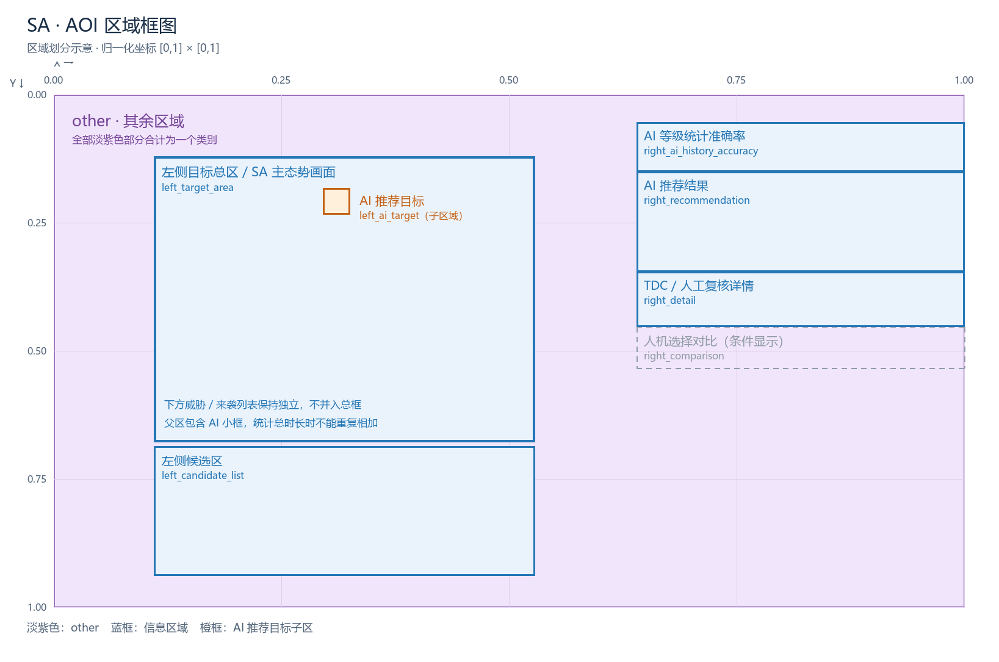
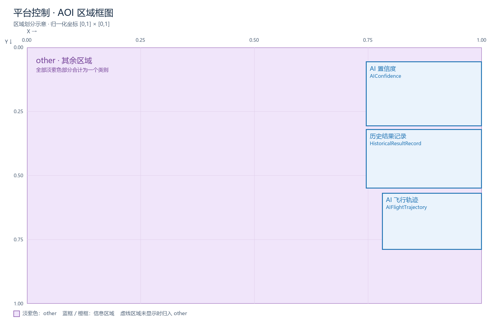
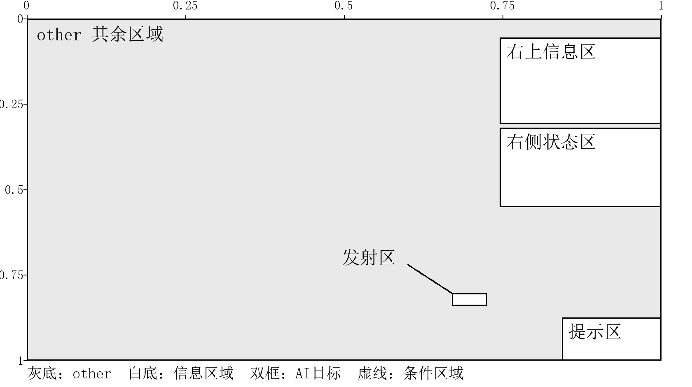

# AOI 区域划分说明

界面按下列 AOI 划分，所有可见 AOI 之外的屏内部分统一归为 **other（其余区域）**。

框图使用 0–1 归一化坐标，左上角为 `(0,0)`，右下角为 `(1,1)`。蓝框表示信息区域，橙框表示 AI 推荐目标，淡紫色表示 other；虚线表示按条件显示的区域。框图用于说明位置与包含关系，具体边界以数据中对应时刻的区域记录为准。

## 1. 雷达目标选择（RADAR）

| 区域标识 | 区域含义 |
| --- | --- |
| `left_candidate_list` | 左侧整个雷达目标显示区 |
| `left_ai_target` | 雷达区内的 AI 推荐目标小框 |
| `right_ai_history_accuracy` | 右侧 AI 等级统计准确率信息 |
| `right_recommendation` | 右侧 AI 推荐结果及目标观测信息 |
| `right_candidate_list` | 右侧候选目标摘要列表 |
| `right_detail` | 右侧目标详情与人工复核信息 |
| `right_comparison` | 右侧 AI 与人工选择的观测对比 |
| `other` | 上述可见区域之外的屏内部分 |

**包含关系：**`left_ai_target` 位于 `left_candidate_list` 内。

## 2. 威胁响应（SA）

| 区域标识 | 区域含义 |
| --- | --- |
| `left_target_area` | 左侧上方整个目标态势显示区 |
| `left_ai_target` | 目标态势区内的 AI 推荐目标小框 |
| `left_candidate_list` | 左侧下方威胁列表与来袭列表，两张表合为一个区域 |
| `right_ai_history_accuracy` | 右侧 AI 等级统计准确率信息 |
| `right_recommendation` | 右侧 AI 推荐威胁及观测信息 |
| `right_detail` | 右侧目标详情与人工复核信息 |
| `right_comparison` | 右侧 AI 与人工选择的观测对比 |
| `other` | 上述可见区域之外的屏内部分 |

**包含关系：**`left_ai_target` 位于 `left_target_area` 内；下方 `left_candidate_list` 独立于目标总区。SA 不单设右侧候选列表区域。

## 3. 平台控制（PLATFORM_CONTROL）

| 区域标识 | 区域含义 |
| --- | --- |
| `AIConfidence` | 右上方 AI 置信度信息 |
| `HistoricalResultRecord` | 右侧中部历史结果记录 |
| `AIFlightTrajectory` | 右侧下方 AI 飞行轨迹 |
| `other` | 上述可见区域之外的屏内部分 |

## 4. 武器发射（WEAPON_FIRING）

| 区域标识 | 区域含义 |
| --- | --- |
| `TrustHistory` | 右上方信息窗口 |
| `TrustStatePanel` | 右侧中部状态窗口 |
| `SHOOT` | 画面右下部的发射相关区域 |
| `Title` | 屏幕右下角提示区域 |
| `other` | 上述可见区域之外的屏内部分 |

**状态说明：**提示出现前，仅有右上和右侧中部两个区域，标识分别为AIConfidence、HistoricalResultRecord。提示出现后，两处边界不变，标识变为TrustHistory、TrustStatePanel，并增加SHOOT和Title。图表展示提示出现后的划分；提示出现前，新增两区所在位置归入other。

## 5. 统一解释

- **other：**整屏减去所有可见 AOI 的并集。多块不连续的剩余部分合为同一类别，可包含按钮、日志、其他任务信息和留白。
- **条件区域：**人机选择不一致时显示对比区；未显示时，其位置若未被其他可见 AOI 覆盖，就归为 other。
- **详情区域：**无目标详情、TDC 聚焦详情和人工复核属于同一 `right_detail` 区域的不同内容状态。
- **父子区域：**AI 推荐目标小框与其总区可同时命中，统计总时间时不能重复相加。
- **任务差异：**RADAR 的 `left_candidate_list` 是整个雷达目标区，SA 的同名区域是下方列表，不应按名称直接视为相同内容。
- **有效范围：**无效眼动、屏外点和无法确定区域的点不归入 other。
