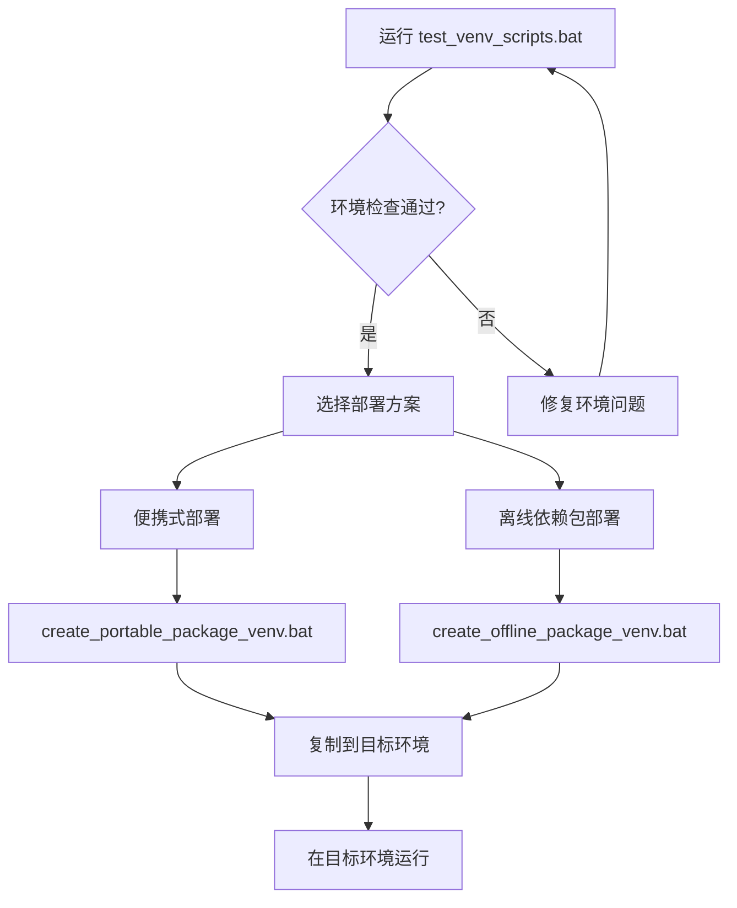
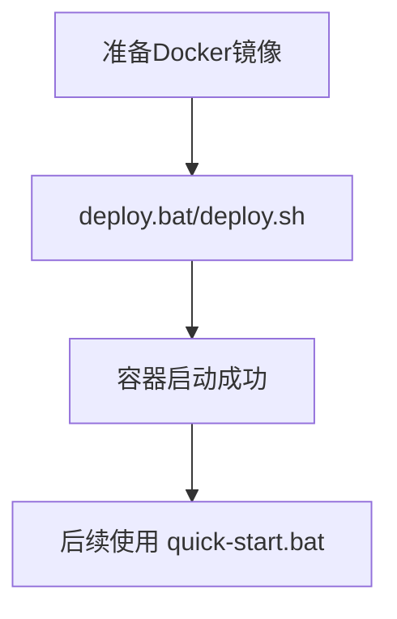

# Server脚本使用指南

## 📋 当前保留的脚本文件

### 🚀 部署相关脚本

#### 1. Docker部署脚本
- **`deploy.bat`** / **`deploy.sh`** - Docker完整部署脚本
  - 功能：导入Docker镜像并启动容器
  - 使用：`deploy.bat` (Windows) 或 `./deploy.sh` (Linux/macOS)
  - 依赖：需要 `radar-server-v2.tar` 镜像文件

- **`quick-start.bat`** / **`quick-start.sh`** - Docker快速启动脚本
  - 功能：快速启动已存在的Docker容器
  - 使用：`quick-start.bat` (Windows) 或 `./quick-start.sh` (Linux/macOS)

#### 2. 离线部署脚本（推荐）
- **`create_offline_package_venv.bat`** - 创建离线依赖包
  - 功能：使用 `server/venv` 创建包含所有依赖的离线部署包
  - 使用：`create_offline_package_venv.bat`
  - 输出：`radar-offline-package/` 文件夹
  - 特点：目标环境需要Python 3.12+

#### 3. 便携式部署脚本（推荐）
- **`create_portable_package_venv.bat`** - 创建便携式部署包
  - 功能：使用 `server/venv` 创建包含完整虚拟环境的便携包
  - 使用：`create_portable_package_venv.bat`
  - 输出：`radar-portable-package/` 文件夹
  - 特点：目标环境无需安装Python

### 🔧 开发和构建脚本

#### 4. 构建脚本
- **`build.bat`** / **`build.sh`** - Docker镜像构建脚本
  - 功能：构建Docker镜像
  - 使用：`build.bat` (Windows) 或 `./build.sh` (Linux/macOS)

#### 5. 开发运行脚本
- **`run-with-dist.bat`** / **`run-with-dist.sh`** - 带前端文件的运行脚本
  - 功能：在开发环境中运行服务器（包含静态文件服务）
  - 使用：`run-with-dist.bat` (Windows) 或 `./run-with-dist.sh` (Linux/macOS)

### 🧪 测试脚本

#### 6. 环境测试脚本
- **`test_venv_scripts.bat`** - 虚拟环境测试脚本
  - 功能：验证 `server/venv` 环境是否正确配置
  - 使用：`test_venv_scripts.bat`
  - 建议：在创建部署包前运行此脚本

## 📊 脚本使用流程

### 离线部署流程


### Docker部署流程


## 🎯 推荐使用方案

### 场景1：目标环境无Python
**推荐**：便携式部署
```cmd
# 1. 测试环境
test_venv_scripts.bat

# 2. 创建便携包
create_portable_package_venv.bat

# 3. 复制 radar-portable-package 到目标环境
# 4. 在目标环境运行 start_radar.bat
```

### 场景2：目标环境有Python 3.12+
**推荐**：离线依赖包部署
```cmd
# 1. 测试环境
test_venv_scripts.bat

# 2. 创建离线包
create_offline_package_venv.bat

# 3. 复制 radar-offline-package 到目标环境
# 4. 在目标环境运行 install_offline.bat
```

### 场景3：目标环境有Docker
**推荐**：Docker部署
```cmd
# 1. 复制 server/ 目录到目标环境
# 2. 确保有 radar-server-v2.tar 镜像文件
# 3. 运行 deploy.bat
```

## 🗂️ 文件组织

### 核心脚本（必需）
- `deploy.bat` / `deploy.sh` - Docker部署
- `create_portable_package_venv.bat` - 便携式部署
- `create_offline_package_venv.bat` - 离线包部署
- `test_venv_scripts.bat` - 环境测试

### 辅助脚本（可选）
- `quick-start.bat` / `quick-start.sh` - Docker快速启动
- `build.bat` / `build.sh` - 镜像构建
- `run-with-dist.bat` / `run-with-dist.sh` - 开发运行

## 📝 注意事项

1. **环境要求**：所有 `*_venv.bat` 脚本都需要 `server/venv` 虚拟环境
2. **测试优先**：使用部署脚本前先运行 `test_venv_scripts.bat`
3. **路径问题**：确保在 `server/` 目录下运行脚本
4. **权限问题**：Windows环境可能需要管理员权限
5. **编码问题**：所有脚本都使用英文输出，避免编码问题

## 🔄 脚本维护

### 已删除的冗余脚本
- ❌ `create_offline_package.bat` - 有编码问题
- ❌ `create_offline_package_fixed.bat` - 虚拟环境路径错误
- ❌ `create_portable_package.bat` - 虚拟环境路径错误
- ❌ `create_portable_package_fixed.bat` - 虚拟环境路径错误

### 保留原则
- ✅ 功能明确，无重复
- ✅ 适配当前环境（server/venv）
- ✅ 无编码问题
- ✅ 有实际使用价值

---

**快速参考**：
- 🧪 测试环境：`test_venv_scripts.bat`
- 💼 便携部署：`create_portable_package_venv.bat`
- 📦 离线部署：`create_offline_package_venv.bat`
- 🐳 Docker部署：`deploy.bat`
