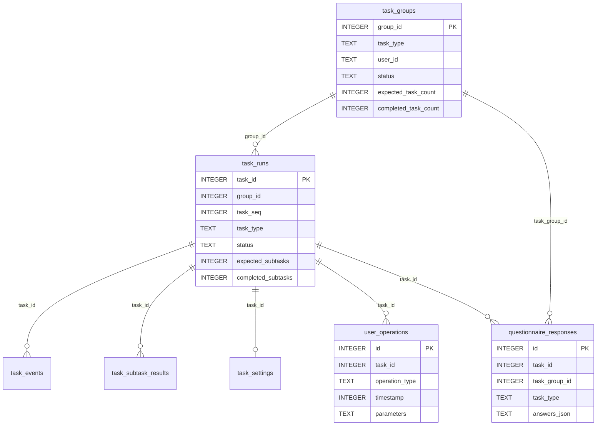

# 数据库说明

本文说明 F18-Radar 服务端当前使用的 SQLite 数据库、主库表结构、任务数据关系、写入时机、查询示例和维护方式。内容以当前代码为准，主库实现位于 `server/managers/database_manager.py`。

## 1. 数据库文件概览

系统的数据没有全部写入同一个文件。

| 数据库 | 默认路径 | 主要用途 | 实现位置 |
|---|---|---|---|
| 雷达主库 | `server/data/radar_operations.db` | 任务组、任务实例、操作记录、任务结果、问卷、进度 | `server/managers/database_manager.py` |
| 眼动索引库 | `server/data/gaze/gaze_records.db` | 眼动任务索引、目标区域、反馈事件、marker | `server/tobii/gaze_service.py` |
| 外部采集器库 | `server/data/external_collectors/collector_records.sqlite3` | 外部采集服务的任务、事件、产出文件 | `server/collectors/storage.py` |
| 生理数据索引库 | `server/data/physio/experiment_data.sqlite3` | 生理任务元数据和 marker | `server/physio/service.py` |

补充说明：

- `server/data/` 已被 `.gitignore` 忽略，数据库文件不会进入 Git。
- 生理原始采样默认写入 `server/data/physio/raw/` 下的 CSV 文件；SQLite 主要保存任务索引和 marker。
- 眼动原始帧写入任务目录中的 `raw_gaze.jsonl`；`gaze_records.db` 是索引和事件库。详细说明见 [眼动数据说明.md](./眼动数据说明.md) 和 [gaze_storage_model.md](./gaze_storage_model.md)。
- 外部采集器数据库路径可通过 `EXTERNAL_COLLECTORS_DB_PATH` 修改。
- 生理数据库路径可通过 `PHYSIO_DB_PATH` 修改。

## 2. 主库初始化与连接方式

服务首次初始化时，`server/main.py` 调用：

```python
db_manager.initialize_database()
```

主库默认路径由 `DatabaseManager` 根据服务端目录计算，因此不依赖启动时的当前工作目录：

```text
server/data/radar_operations.db
```

主库使用 SQLite WAL 模式：

```sql
PRAGMA journal_mode=WAL;
```

写入方式分为两类：

1. `task_settings`、`user_operations`、`questionnaire_responses` 等通过后台写入队列异步提交。
2. `task_groups`、`task_runs`、`task_events`、`task_subtask_results` 等生命周期数据使用独立连接同步提交。

因此，刚调用异步记录方法后立即从另一个连接查询，短时间内可能还看不到新记录。服务正常退出时会停止写入线程并执行 WAL checkpoint。

## 3. 核心数据关系



关系说明：

- `task_groups` 表示“一组配置相同、完成后需要统一结算的任务”。难度或 AI 等级切换后应产生新的任务组。
- `task_runs` 表示一次实际任务实例，可通过 `group_id` 归属于任务组。
- `task_events` 保存任务生命周期事件，例如开始、子任务开始、子任务结束和任务结果。
- `task_subtask_results` 保存每个子任务的结构化结果和统计指标。
- `task_settings` 和 `user_operations` 保存 RADAR/SA 实验任务的配置和操作明细。
- `questionnaire_responses.task_group_id` 用来把问卷绑定到完成的任务组。

当前代码主要通过业务逻辑维护这些关系，并未为所有关联字段声明或启用 SQLite 外键约束。不要依赖数据库自动级联删除或自动检查关联完整性。

## 4. 任务类型常量

主库中使用以下标准任务类型：

| task_type | 含义 |
|---|---|
| `RADAR_TARGETING` | RADAR 传感器目标识别 |
| `SA_THREAT_RESPONSE` | SA 威胁排序/态势感知 |
| `PLATFORM_CONTROL` | 平台控制 |
| `WEAPON_FIRING` | 武器发射 |

历史值 `WEAPON_LAUNCH` 在问卷上下文解析时会转换为 `WEAPON_FIRING`。

## 5. 主库表结构

### 5.1 `task_groups`：任务组

这是任务组完成判断和问卷上下文的主要数据源。

| 字段 | 类型 | 说明 |
|---|---|---|
| `group_id` | INTEGER PK | 任务组 ID |
| `task_type` | TEXT | 标准任务类型 |
| `user_id` | TEXT | 被试/用户 ID |
| `status` | TEXT | 通常为 `active` 或 `completed` |
| `expected_task_count` | INTEGER | 本组预计任务数 |
| `completed_task_count` | INTEGER | 已完成任务数 |
| `current_task_seq` | INTEGER | 当前任务序号 |
| `started_at_ms` | INTEGER | 组开始时间，Unix 毫秒 |
| `completed_at_ms` | INTEGER | 组完成时间，Unix 毫秒 |
| `difficulty` | TEXT | `low` / `medium` / `high` |
| `autonomy_level` | TEXT | AI 自主等级，例如 `L1` / `L2` / `L3` |
| `is_ai_active` | BOOLEAN | 是否为 AI 模式 |
| `is_practice` | BOOLEAN | 是否为练习模式 |
| `progress_key` | TEXT | 任务进度隔离键 |
| `config_json` | TEXT | 规范化配置 JSON |
| `raw_message_json` | TEXT | 最近的外部原始消息 JSON |
| `created_at` | TIMESTAMP | SQLite 创建时间 |
| `updated_at` | TIMESTAMP | SQLite 更新时间 |

索引：

```sql
CREATE INDEX idx_task_groups_active
ON task_groups(user_id, task_type, status, started_at_ms);
```

### 5.2 `task_runs`：任务实例

| 字段 | 类型 | 说明 |
|---|---|---|
| `task_id` | INTEGER PK | 内部任务 ID |
| `group_id` | INTEGER | 所属任务组 ID，可为空 |
| `task_seq` | INTEGER | 在组内的任务序号 |
| `task_type` | TEXT | 标准任务类型 |
| `user_id` | TEXT | 被试/用户 ID |
| `status` | TEXT | 通常为 `active` 或 `completed` |
| `expected_subtasks` | INTEGER | 预计子任务数 |
| `completed_subtasks` | INTEGER | 已完成子任务数 |
| `current_subtask_seq` | INTEGER | 当前子任务序号 |
| `started_at_ms` | INTEGER | 开始时间，Unix 毫秒 |
| `completed_at_ms` | INTEGER | 完成时间，Unix 毫秒 |
| `config_json` | TEXT | 本次任务配置 JSON |
| `last_raw_message_json` | TEXT | 最近的外部原始消息 JSON |
| `created_at` | TIMESTAMP | SQLite 创建时间 |
| `updated_at` | TIMESTAMP | SQLite 更新时间 |

索引：

```sql
CREATE INDEX idx_task_runs_active
ON task_runs(user_id, task_type, status, started_at_ms);
```

### 5.3 `task_events`：生命周期事件

| 字段 | 类型 | 说明 |
|---|---|---|
| `id` | INTEGER PK | 自增 ID |
| `task_id` | INTEGER | 任务 ID |
| `task_type` | TEXT | 标准任务类型 |
| `user_id` | TEXT | 被试/用户 ID |
| `event_type` | TEXT | 事件类型，如 `task_start`、`sub_start`、`sub_end`、`task_result` |
| `sub_task_seq` | INTEGER | 子任务序号，可为空 |
| `timestamp_ms` | INTEGER | 事件时间，Unix 毫秒 |
| `payload_json` | TEXT | 解析后的事件数据 JSON |
| `raw_message_json` | TEXT | 原始消息 JSON |
| `created_at` | TIMESTAMP | SQLite 创建时间 |

唯一事件不会自动去重；是否重复由协议处理层控制。

### 5.4 `task_subtask_results`：子任务结果

| 字段 | 类型 | 说明 |
|---|---|---|
| `id` | INTEGER PK | 自增 ID |
| `task_id` | INTEGER | 任务 ID |
| `task_type` | TEXT | 标准任务类型 |
| `user_id` | TEXT | 被试/用户 ID |
| `sub_task_seq` | INTEGER | 子任务序号 |
| `result_json` | TEXT | 完整结果 JSON |
| `current_task_score` | REAL | 当前任务得分 |
| `ai_control_time` | REAL | AI 控制时长 |
| `person_control_time` | REAL | 人工控制时长 |
| `ai_remind_time` | REAL | AI 提醒时长 |
| `switch_count` | INTEGER | 控制模式切换次数 |
| `fire_count` | INTEGER | 发射次数 |
| `fire_success_count` | INTEGER | 成功发射次数 |
| `timestamp_ms` | INTEGER | 结果时间，Unix 毫秒 |
| `created_at` | TIMESTAMP | SQLite 创建时间 |

唯一索引为 `(task_id, sub_task_seq)`。写入使用 `INSERT OR REPLACE`，同一任务同一子任务序号的新结果会替换旧结果。

### 5.5 `task_settings`：任务配置快照

| 字段 | 类型 | 说明 |
|---|---|---|
| `id` | INTEGER PK | 自增 ID |
| `task_id` | INTEGER UNIQUE | 任务 ID |
| `user_id` | TEXT | 被试/用户 ID |
| `task_type` | TEXT | 标准任务类型 |
| `event_owner` | TEXT | 操作方，通常为 `AI` 或 `manual` |
| `execution_timestamp` | TIMESTAMP | SQLite 写入时间 |
| `repetition_count` | INTEGER | 当前重复序号 |
| `is_ai_active` | BOOLEAN | 是否为 AI 模式 |
| `ai_level_config` | TEXT | AI 等级配置 JSON |
| `difficulty_config` | TEXT | 难度配置 JSON |
| `audio_enabled` | BOOLEAN | 是否启用声音 |
| `ai_level_name` | TEXT | AI 等级名称 |
| `difficulty_name` | TEXT | `low` / `medium` / `high` |
| `trust_state` | TEXT | 信任校准状态 |

正式任务才写入该表。练习模式会跳过记录。

系统会按照用户、任务类型、操作方、重复序号、AI 状态、AI 等级、难度、声音和信任状态组合去重；重做未完成任务时可能复用已有 `task_id`。

### 5.6 `user_operations`：操作明细

| 字段 | 类型 | 说明 |
|---|---|---|
| `id` | INTEGER PK | 自增 ID |
| `task_id` | INTEGER | 任务 ID |
| `operation_type` | TEXT | 操作类型 |
| `timestamp` | INTEGER | 客户端/事件时间，通常为 Unix 毫秒 |
| `receive_timestamp` | INTEGER | 对应指令的接收时间，可为空 |
| `is_active` | INTEGER | 是否为有效操作，0/1 |
| `parameters` | TEXT | 操作参数 JSON |
| `user_id` | TEXT | 被试/用户 ID |
| `event_owner` | TEXT | `AI` 或 `manual` |
| `is_correct` | TEXT | `true` / `false` / `not_set` |
| `created_at` | TIMESTAMP | SQLite 写入时间 |

正式任务才写入该表。练习模式会跳过记录。

以下操作在每个任务内只保留第一条：

- `settings_update`
- `antenna_adjusted`
- `sa_emergency`
- `sa_emergency_enhanced`

`target_selected` 和 `threat_clicked` 按 `(task_id, operation_type, event_owner)` 去重，AI 和人工可各保留一条。

### 5.7 `user_progress`：用户任务进度

主键为 `(user_id, task_type)`，用于任务场景队列和 AI/人工模式进度恢复。

主要字段：

- `current_scenario_json`、`repetition_counter`
- `ai_queue_json`、`manual_queue_json`
- `is_completed`、`is_ai_completed`、`is_manual_completed`
- `ai_current_scenario_json`、`ai_repetition_counter`
- `manual_current_scenario_json`、`manual_repetition_counter`
- `last_updated`

不要手工只修改一个计数字段；AI 和人工模式分别维护独立进度，单字段修改容易造成队列与计数不一致。

### 5.8 `questionnaire_responses`：问卷结果

| 字段 | 类型 | 说明 |
|---|---|---|
| `id` | INTEGER PK | 自增 ID |
| `user_id` | TEXT | 被试/用户 ID |
| `task_id` | INTEGER | 解析出的任务 ID |
| `task_group_id` | INTEGER | 问卷所属任务组 ID |
| `task_type` | TEXT | 标准任务类型 |
| `repetition_current` | INTEGER | 当前重复序号 |
| `repetition_total` | INTEGER | 总重复数 |
| `difficulty` | TEXT | `low` / `medium` / `high` |
| `autonomy_level` | TEXT | AI 自主等级 |
| `is_ai_active` | BOOLEAN | 是否为 AI 模式 |
| `is_practice` | BOOLEAN | 是否为练习模式 |
| `answers_json` | TEXT | 问卷答案 JSON |
| `source` | TEXT | 提交来源，例如 WebSocket/HTTP |
| `client_timestamp` | INTEGER | 客户端时间戳 |
| `created_at` | TIMESTAMP | SQLite 写入时间 |

问卷保存时不会完全信任前端提交的难度和 AI 等级，而会调用 `resolve_questionnaire_task_context()` 查询数据库：

1. 优先使用同一用户、同一任务类型的活跃 `task_groups`。
2. 若提交了有效 `task_id`，尝试读取对应 `task_runs`。
3. 否则回退到最近完成的 `task_runs`。

因此任务组数据是否正确，会直接影响问卷归属和问卷配置。

### 5.9 `platform_external_tasks`：旧版外部平台事件兼容表

该表用于保存外部平台的原始生命周期消息和结果指标，包括 `task_category`、`event_type`、难度、AI 等级、控制时长、切换次数和发射统计等。

注意：当前 `DatabaseManager.initialize_database()` 没有调用该表的创建函数。已有数据库可能保留该表，但全新数据库不能假设它一定存在。新的任务生命周期应以 `task_groups`、`task_runs`、`task_events` 和 `task_subtask_results` 为主。

### 5.10 统计结果表

`server/data_statistics.py` 可在主库中额外创建：

- `sensor_task_statistics`
- `threat_task_statistics`

它们是离线统计结果，不由 `server/main.py` 的数据库初始化自动创建，也不是任务运行时的权威数据源。

## 6. 一次任务的数据写入流程

### 外部任务协议

```text
外部 task_start
  -> task_groups：创建/恢复一组任务
  -> task_runs：创建当前任务实例
  -> task_events：记录 task_start/sub_start

外部 sub_end 或 task_result
  -> task_subtask_results：保存子任务结果
  -> task_events：记录 sub_end/task_result
  -> task_runs：更新完成数和状态
  -> task_groups：更新整组完成数和状态

任务组完成后提交问卷
  -> questionnaire_responses：绑定 task_group_id
```

### RADAR/SA 页面任务

```text
任务开始
  -> task_settings：保存配置快照（仅正式任务）
  -> user_operations：保存 task_start 和后续操作（仅正式任务）
  -> task_runs/task_groups：保存生命周期和组进度

操作过程
  -> user_operations：settings_update、antenna_adjusted、target_selected、threat_clicked 等

任务组完成
  -> questionnaire_responses：保存问卷
```

## 7. 难度和布尔值规范

数据库中的规范难度值为：

```text
low / medium / high
```

外部 WebSocket 协议中的原始数字必须先在协议层转换为规范字符串，再写入数据库。不要把外部协议的 `Difficulty` 数字直接传给 `DatabaseManager.normalize_difficulty_value()`；该方法还保留了历史内部数字映射，和当前外部协议数字语义不是同一套规则。

SQLite 没有独立 BOOLEAN 存储类型，本项目通常以整数保存：

```text
0 = false
1 = true
```

## 8. 时间单位

不同子系统使用的时间单位不同，查询和跨库关联时必须先换算。

| 数据 | 字段示例 | 单位 |
|---|---|---|
| 主库任务生命周期 | `started_at_ms`、`completed_at_ms`、`timestamp_ms` | 毫秒 |
| 主库操作 | `user_operations.timestamp` | 通常为毫秒 |
| 眼动任务/目标 | `start_time_us`、`appear_time_us` | 微秒 |
| 眼动反馈事件 | `event_time_ms` | 毫秒 |
| 生理任务和 marker | `started_at_ns`、`service_time_ns` | 纳秒 |
| 外部采集器 | `started_at_ns`、`service_time_ns` | 纳秒 |

换算关系：

```text
1 秒 = 1,000 毫秒 = 1,000,000 微秒 = 1,000,000,000 纳秒
```

## 9. 常用查询

以下 SQL 可通过 SQLite 客户端执行。

### 9.1 查看最近任务组

```sql
SELECT
    group_id,
    user_id,
    task_type,
    status,
    completed_task_count,
    expected_task_count,
    difficulty,
    autonomy_level,
    is_ai_active,
    datetime(started_at_ms / 1000, 'unixepoch', 'localtime') AS started_at
FROM task_groups
ORDER BY started_at_ms DESC
LIMIT 20;
```

### 9.2 查看某一任务组的任务实例

```sql
SELECT
    task_id,
    group_id,
    task_seq,
    task_type,
    status,
    completed_subtasks,
    expected_subtasks
FROM task_runs
WHERE group_id = 123
ORDER BY task_seq, task_id;
```

### 9.3 查看任务操作和配置

```sql
SELECT
    uo.task_id,
    uo.operation_type,
    uo.event_owner,
    uo.is_correct,
    uo.timestamp,
    uo.parameters,
    ts.task_type,
    ts.ai_level_name,
    ts.difficulty_name,
    ts.is_ai_active
FROM user_operations AS uo
LEFT JOIN task_settings AS ts ON ts.task_id = uo.task_id
WHERE uo.task_id = 123
ORDER BY uo.timestamp, uo.id;
```

### 9.4 查看仍未完成的任务组

```sql
SELECT *
FROM task_groups
WHERE status != 'completed'
ORDER BY started_at_ms DESC;
```

### 9.5 查看子任务结果

```sql
SELECT
    task_id,
    sub_task_seq,
    current_task_score,
    ai_control_time,
    person_control_time,
    switch_count,
    fire_count,
    fire_success_count,
    result_json
FROM task_subtask_results
WHERE task_id = 123
ORDER BY sub_task_seq;
```

### 9.6 查看任务组问卷

```sql
SELECT
    id,
    user_id,
    task_group_id,
    task_type,
    difficulty,
    autonomy_level,
    is_ai_active,
    answers_json,
    created_at
FROM questionnaire_responses
WHERE task_group_id = 123
ORDER BY created_at;
```

### 9.7 检查问卷是否关联到不存在的任务组

```sql
SELECT qr.*
FROM questionnaire_responses AS qr
LEFT JOIN task_groups AS tg ON tg.group_id = qr.task_group_id
WHERE qr.task_group_id IS NOT NULL
  AND tg.group_id IS NULL;
```

## 10. 备份与维护

### 推荐备份方式

最安全的方式是先正常停止服务，等待后台写入队列退出和 WAL checkpoint 完成，再复制数据库文件：

```powershell
Copy-Item server\data\radar_operations.db server\data\radar_operations.backup.db
```

如果必须在线备份，应使用 SQLite 客户端的 `.backup` 命令，不要只复制正在写入的 `.db` 而忽略同目录下的 `-wal` 和 `-shm` 文件。

### 完整性检查

```sql
PRAGMA integrity_check;
```

正常结果应为：

```text
ok
```

### WAL 检查点

服务正常退出时会自动处理。手工执行前应先确认服务已经停止：

```sql
PRAGMA wal_checkpoint(TRUNCATE);
```

### 不建议的操作

- 不要在服务运行期间直接修改任务状态或删除任务行。
- 不要只删除 `task_groups` 或 `task_runs` 中的一侧。
- 不要用任务结果 JSON 反向覆盖生命周期计数字段。
- 不要把 `created_at` 当作外部事件发生时间；应优先使用 `*_at_ms`、`timestamp_ms` 或 `timestamp`。
- 不要依赖数据库外键自动清理关联数据。

## 11. 故障排查

### 数据写入后立即查询不到

`task_settings`、`user_operations` 和问卷使用异步写入队列。等待短暂时间后再查询，并检查数据库日志中是否出现 `Failed to execute DB operation`。

### 任务已经完成，但任务组仍为 active

依次检查：

1. `task_events` 是否收到预期数量的 `sub_end` 或 `task_result`。
2. `task_subtask_results` 的 `(task_id, sub_task_seq)` 是否完整。
3. `task_runs.completed_subtasks` 是否达到 `expected_subtasks`。
4. `task_groups.completed_task_count` 是否达到 `expected_task_count`。
5. `task_runs.group_id` 是否指向正确任务组。

### 问卷关联到错误难度或 AI 等级

优先检查 `task_groups` 中的：

- `difficulty`
- `autonomy_level`
- `is_ai_active`
- `is_practice`
- `config_json`

问卷保存会优先采用数据库任务上下文，而不是前端展示字段。

### 数据库被占用或存在 WAL 文件

先确认没有旧的 `python main.py` 服务仍在运行。正常停止服务后，程序会关闭写入线程并清理 WAL。不要在进程仍运行时强制删除 `-wal` 或 `-shm` 文件。

## 12. 相关代码和文档

- 主库管理：`server/managers/database_manager.py`
- 系统初始化与退出：`server/main.py`
- 外部任务协议：`server/docs/external_task_protocol.md`
- 眼动数据：`server/docs/眼动数据说明.md`
- 眼动存储模型：`server/docs/gaze_storage_model.md`
- 生理数据：`server/physio/README.md`
- 离线任务统计：`server/data_statistics.py`
- 眼动/任务联合统计：`server/statistics/threat_gaze_statistics.py`
