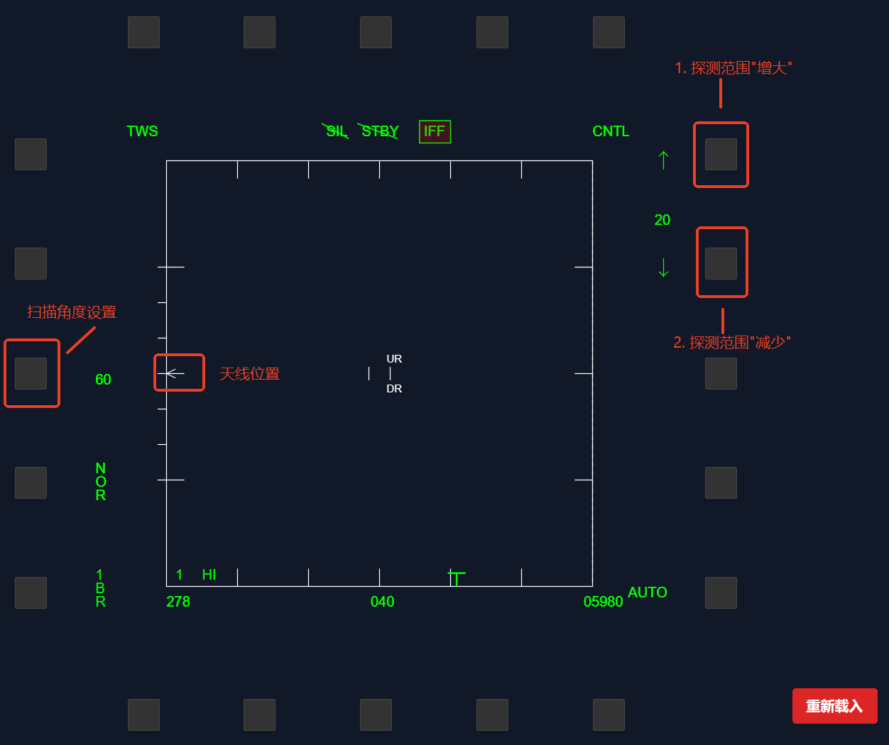
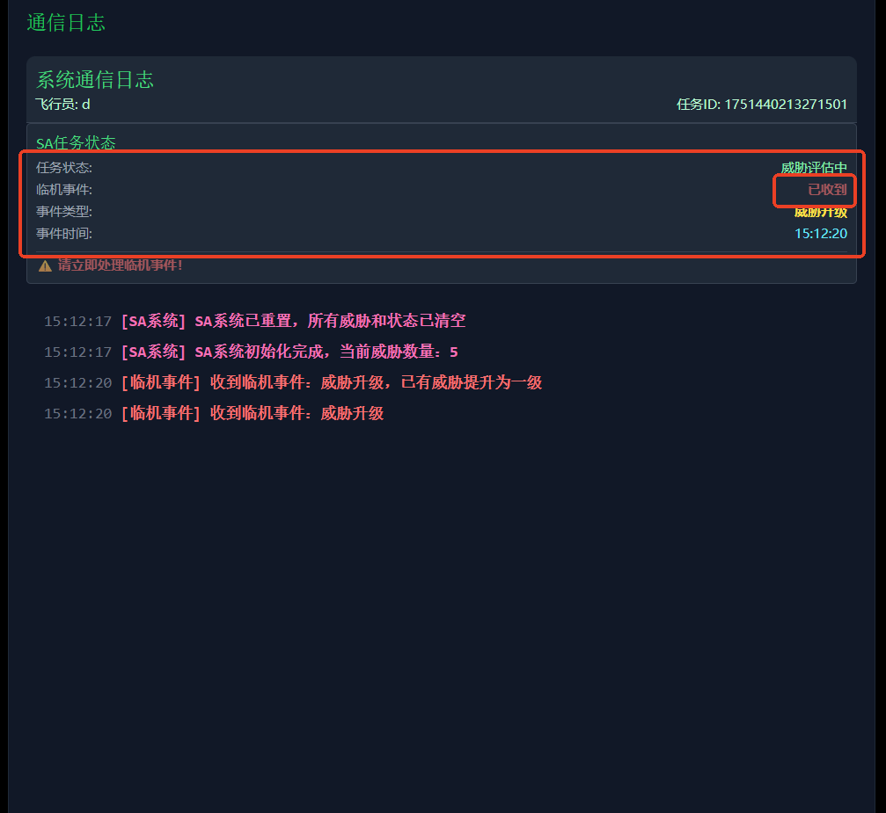
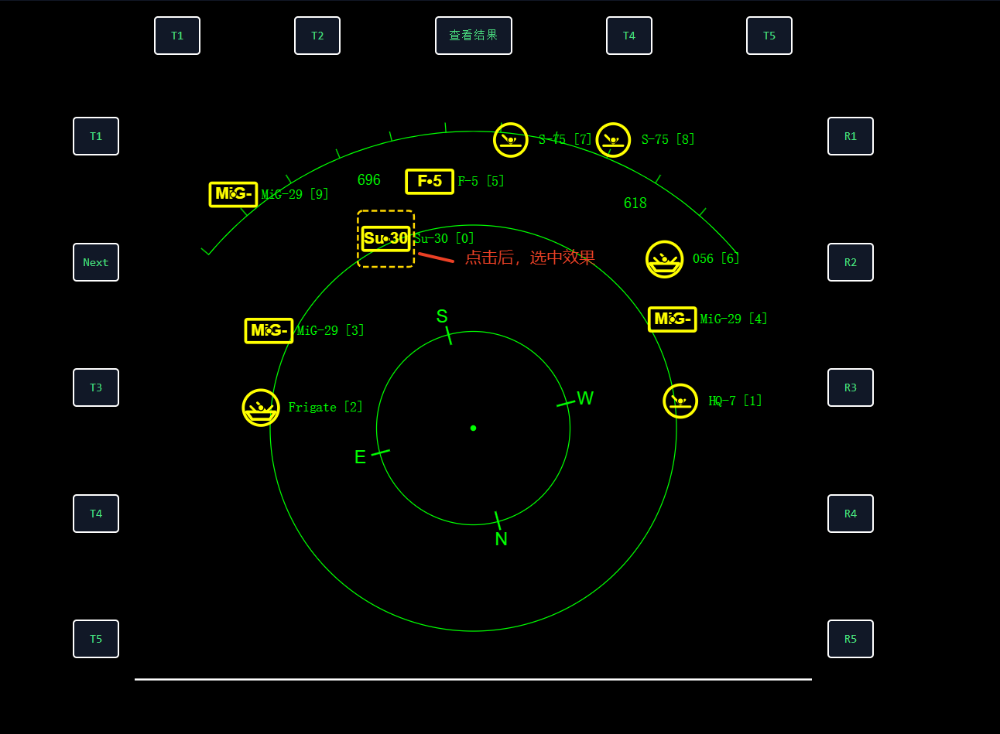

# JF-17雷达系统模拟器 - 用户操作手册

## 目录
1. [系统概述](#系统概述)
2. [登录与初始设置](#登录与初始设置)
3. [雷达目标识别任务](#雷达目标识别任务)
4. [SA威胁应对任务](#sa威胁应对任务)
5. [AI智能助手使用](#ai智能助手使用)
6. [任务记录与进度显示](#任务记录与进度显示)
7. [快捷键参考](#快捷键参考)
8. [常见问题解答](#常见问题解答)

---

## 系统概述

JF-17雷达系统模拟器是一个飞行器雷达操作练习系统，提供仿真的雷达操作体验。


### 主要任务类型
- **雷达目标识别任务**：空对空雷达探测、跟踪和识别目标
- **SA威胁应对任务**：态势感知和威胁评估练习

### 模式说明
- **练习模式**：无限次练习，熟悉操作流程
- **正式模式**：正式评估，记录操作成绩

---

## 登录与初始设置

### 启动系统
1. 打开浏览器，访问系统地址
2. 等待系统加载完成

### 用户登录
1. **输入用户ID**
   - 输入你的用户标识（用于记录和识别）
   - 例如：`张三_001` 或 `pilot_001`

2. **选择AI助手**
   - ✅ **启用AI助手**：系统会提供智能操作建议和自动化功能
   - ❌ **不启用AI助手**：完全手动操作模式

3. **选择任务类型**
   - **雷达任务**：进入雷达目标识别练习
   - **SA任务**：进入威胁应对练习

4. **选择练习模式**
   - **练习模式**：用于学习和熟悉操作
   - **正式模式**：用于考核评估

5. **点击"开始"**进入练习界面

---

## 雷达目标识别任务

### 任务目标
在雷达屏幕上发现、锁定并识别空中目标，判断敌我属性。

### 界面介绍

#### 主要显示区域
- **雷达显示屏**：中央圆形区域，显示目标回波
- **扫描线**：绿色旋转线，表示雷达扫描方向
- **TDC光标**：十字形光标，用于选择目标
- **参数显示**：显示距离、角度、高度等信息

#### 控制面板
- **雷达控制按钮**：开关、模式切换等
- **IFF按钮**：敌我识别功能
- **天线控制**：调整雷达仰角

*图1: 雷达任务设置操作*

### 操作步骤

#### 1. 系统准备
1. **检查连接状态**
   - 确认右上角显示"已连接"
   - 如显示"未连接"，请等待或刷新页面
2. **设置雷达扫描距离**
   - 在数组[10,20,40,80] 之间变化
   - 设置方式参考图1
3. **设置雷达扫描范围**
   - 在数组[15，30，60] 之间变化
   - 设置方式参考图1
3. **天线调整**（如有提示）
   - 根据屏幕提示调整天线俯仰角
   - 使用鼠标拖拽或按钮控制
   - 调整到目标角度后确认
   - 按键 b 图1中左侧天线箭头向上移动
   - 按键 t 图1中左侧天线箭头向下移动


*图2: 雷达任务设置参考*
#### 2. 目标搜索
1. **观察雷达屏幕**
   - 注意扫描线扫过的区域
   - 目标会以黄色符号显示

2. **目标类型识别**
   - **未知目标**：黄色标号，"--"


#### 3. 目标锁定
锁定方法：
**方法：TDC光标锁定**
- 参考[目标识别算法](#目标识别算法)选择锁定目标
- 使用方向键控制TDC光标移动
- 将光标移动到目标位置
- 按 `Enter` 键锁定目标


#### 4. 敌我识别（IFF）
1. **激活IFF系统**
   - 锁定目标后，点击"IFF"按钮
   - 注意任务需要在开启IFF之前完成

2. **等待识别结果**
   - 系统处理中会显示加载状态
   - 识别完成后显示结果

3. **查看识别结果**
   - **友机**：显示绿色友好标识
   - **敌机**：显示红色敌对标识

#### 5. 任务完成
1. **查看操作日志**
   - 右侧面板显示所有操作记录
   - 包括锁定时间、识别结果等

2. **激活IFF系统**
   - 查看识别结果
   - 进入下一次任务

### 目标识别算法

#### 算法概述
系统采用基于威胁分数的自动敌我识别策略。当雷达探测到一批未知目标时，系统会为每个目标计算"威胁分数"，并以此作为敌我判定的主要依据。

#### 核心评估维度

**1. 距离分数 (Distance Score)**
- 目标离本机越近，威胁越大
- 距离分数为归一化值（0-1之间）
- 距离越近，分数越高

**2. 航向分数 (Heading Score)**
- 评估目标的飞行意图和威胁程度
- 基于目标绝对航向角度计算
- 采用连续变化的威胁评估模型

#### 航向威胁评分规则
| 航向角度 | 威胁分数 | 威胁状态 |
|---------|---------|---------|
| 0°（正北） | -1 | 最低威胁（远离状态） |
| 90°/270°（东西） | 0 | 中等威胁 |
| 180°（正南） | +1 | 最高威胁（接近状态） |

**计算公式：** `航向分数 = -cos(航向角度)`

#### 加权计分算法
系统使用加权平均方式综合两个维度：

```
总威胁分数 = (距离分数 × 90%) + (航向分数 × 10%)
```

**权重说明：**
- **距离因素**占90%：距离是最重要的威胁判定因素
- **航向因素**占10%：目标飞行方向作为辅助判定

#### 最终识别规则
1. **威胁排序**：系统将所有未知目标按总威胁分数从高到低排序
2. **敌我判定**：得分最高的2个目标被识别为"敌机"（红色标识）
3. **友机标识**：其余所有目标被识别为"友机"（绿色标识）

---

## SA威胁应对任务

### 任务目标
观察态势感知显示屏，识别各类威胁，评估威胁优先级，制定应对策略。

### 界面介绍

#### 显示区域
- **圆形显示区**：主要威胁显示区域
- **威胁图标**：不同颜色和形状代表不同威胁类型
- **本机位置**：显示区域底部中心点
- **方向指示**：E/S/W/N方向标记

#### 威胁类型图标
| 威胁类型 | 图标颜色 | 威胁等级 | 说明 |
|---------|---------|---------|------|
| Primary Air | 🔴 红色 | 高 | 主要空中威胁 |
| Secondary Air | 🟡 黄色 | 中 | 次要空中威胁 |
| Primary Anti-Aircraft Artillery | 🔴 红色 | 高 | 主要防空炮威胁 |
| Secondary Anti-Aircraft Artillery | 🟡 黄色 | 中 | 次要防空炮威胁 |
| Primary Naval | 🔴 红色 | 高 | 主要海上威胁 |
| Secondary Naval | 🟡 黄色 | 中 | 次要海上威胁 |
| Missile Up/Down | 🔴 红色 | 极高 | 导弹威胁 |

#### 控制面板
- **查看结果**：显示威胁优先级排序
- **Next按钮**：进行下一次任务

### 操作步骤

#### 1. 态势观察
1. **整体扫视**
   - 快速浏览整个显示区域
   - 识别所有可见威胁的位置和类型
   - 注意威胁的分布模式

2. **威胁分类**
   - **红色图标**：高威胁，需要优先关注
   - **黄色图标**：中等威胁，次要关注
   - **导弹图标**：极高威胁，需要优先关注

#### 2. 威胁分析
1. **距离评估**
   - 分析前确认"临机事件"已经发生，如图3
   - 观察威胁与本机的相对距离
   - 距离越近，威胁等级越高
   - 注意最近的威胁目标

2. **类型优先级**
   - **导弹威胁**：最高优先级
   - **Primary威胁**：高优先级
   - **Secondary威胁**：中等优先级


*图3: SA日志项说明*

#### 3. 威胁选择
1. **选择最具威胁项**
   - 点击对应图标， 图4效果
   - 注意临机事件未发生，点击无效


*图4: SA选择效果展示*
#### 4. 结果查看
1. **点击"查看结果"按钮**
   - 系统自动计算威胁优先级
   - 显示详细的威胁排序列表

2. **威胁列表解读**
   - **序号**：威胁优先级排名
   - **类型**：威胁分类
   - **来源**：Primary/Secondary分类
   - **距离**：与本机的距离（像素）
   - **得分**：威胁评分（越高越危险）
   - **优先级**：威胁等级


### 威胁评分算法
系统根据以下因素计算威胁得分：
- **距离因素** 距离越近得分越高
- **类型权重**：导弹(242) > Primary(240) > Secondary(200)

**计算公式**：`威胁得分 = 类型权重 ÷ 距离`

### 操作技巧
1. **快速识别**：先看颜色（红>黄），再看距离（近>远）
2. **重点关注**：导弹威胁和红色图标
3. **动态评估**：态势会变化，需要持续观察
4. **优先级原则**：选择最具威胁项

---

## AI智能助手使用

### AI助手功能
当启用AI助手时，系统会提供智能化的操作建议和自动化功能。


### 雷达任务中的AI助手

#### 自动目标选择
- AI会自动识别最优目标
- 优先选择距离近、威胁大的目标
- 用户可以接受或拒绝AI建议（拒绝则重新选择）

#### 自动TDC控制
- AI可以自动移动TDC光标到目标位置
- 减少手动操作时间
- 提高锁定精度

#### 操作建议
- AI会在屏幕上显示操作提示
- 用户若觉得不对则重新选择

### SA任务中的AI助手

#### 威胁识别建议
- AI会标记重要威胁
- 提供威胁优先级建议
- 辅助用户快速识别关键威胁

#### 策略建议
- 根据威胁分布提供应对建议
- 推荐最优的处理顺序
- 帮助制定有效的应对策略

### 与AI协作技巧
1. **学习模式**：观察AI的操作逻辑，学习最佳实践
2. **验证建议**：不要盲从AI，要验证其建议的合理性
3. **手动干预**：必要时可以覆盖AI的选择

---

## 任务记录与进度显示

### 任务信息面板
系统左上角显示详细的任务进度和状态信息，帮助用户了解当前练习情况。

### 显示内容说明

#### 基本信息
| 字段 | 说明 | 示例 |
|------|------|------|
| **模式** | 当前练习模式 | `练习模式` / `正式模式` |
| **难度** | 任务难度等级 | `低` / `中等` / `困难` |
| **场景类型** | 当前场景在总场景中的序号 | `2 / 5`（当前第2个场景，共5个场景） |
| **重复进度** | 当前重复次数和总次数 | `3 / 10`（已完成3次，共需10次） |
| **音频** | 音频提示状态 | `开启` / `关闭` |

#### 模式说明
- **练习模式**：用于学习和熟悉操作，不计入正式成绩
- **正式模式**：正式考核模式，操作结果会被记录和评估

#### 难度等级
- **低**：基础难度，目标较少，时间充裕
- **中等**：标准难度，目标数量适中
- **困难**：高级难度，目标较多，要求更高的操作精度和速度

#### 场景类型
- 每个任务包含多个不同的场景配置
- 不同场景有不同的目标分布和威胁配置
- 系统会按序进行各种场景的练习

#### 重复进度
- 显示当前任务的完成进度
- 需要完成规定次数才能进入下一阶段
- 练习模式可以无限重复，正式模式按规定次数进行

#### 音频状态
- **开启**：系统会播放操作提示音和警报声
- **关闭**：静音模式

### 策略说明按钮
任务信息面板底部的"策略说明"按钮可以打开详细的操作指导：
- **雷达任务**：链接到雷达目标识别策略说明
- **SA任务**：链接到威胁计算规则说明

---

## 快捷键参考

### 雷达任务快捷键

#### 基本操作
| 快捷键 | 功能 |
|--------|------|
| `方向键` | 控制TDC光标移动 |
| `Enter` | 锁定TDC光标位置的目标 |
| `按键b` | 雷达天线向上移动 |
| `按键t` | 雷达天线向下移动 |
| `鼠标单机面板对应按钮` | 设置雷达探测距离和范围 |


### SA任务快捷键

#### 基本操作
| 快捷键 | 功能 |
|--------|------|
| `点击威胁项图标` | 认定当前项为最具威胁项 |
| `点击"查看结果"` | 确认结果 |
| `点击"Next"` | 直接进入下一次 |


---

## 常见问题解答

### 连接问题

**Q: 右上角显示"未连接"怎么办？**
- A: 刷新页面重新连接，或联系管理员检查服务器状态

**Q: 系统响应很慢怎么办？**
- A: 关闭其他浏览器标签页，清除浏览器缓存，检查网络连接

### 雷达任务问题

**Q: 点击目标没有反应？**
- A: 确保目标在扫描范围内，尝试使用TDC光标或空格键锁定


**Q: 找不到目标？**
- A: 等待扫描线扫过更多区域，调整雷达距离范围，检查天线角度

### SA任务问题

**Q: 威胁排序不合理？**
- A: 系统按距离和类型自动排序，可以参考但要结合实际情况判断


### AI助手问题

**Q: AI助手没有反应？**
- A: 确认在登录时已启用AI助手

**Q: AI建议不合理？**
- A: AI建议仅供参考，用户可以根据实际情况做出自己的判断


### 操作技巧问题

**Q: 如何判断操作是否正确？**
- A: 雷达任务点击IFF, SA任务点击查看结果

**Q: 练习模式和正式模式有什么区别？**
- A: 练习模式可以无限重试，正式模式会记录成绩用于评估

---

*本手册专注于用户操作指导，如需技术支持请联系系统管理员* 